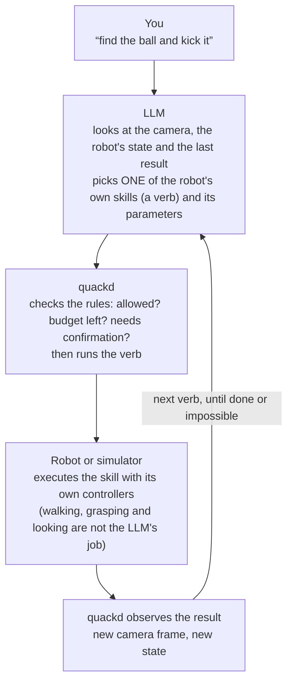
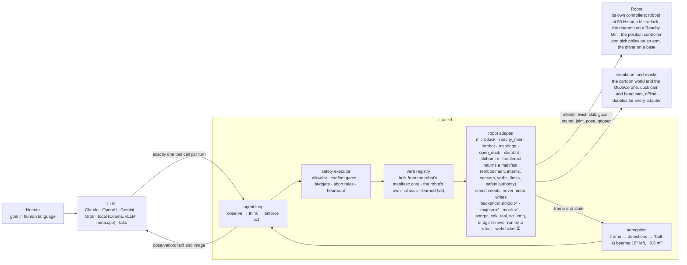

<p align="center">
  
</p>

<p align="center"><strong>Give your Microduck a brain. Or one of seven other small robots, from a Reachy Mini head to a ToddlerBot humanoid. Any LLM, one <code>.duck</code> file.</strong><br>
<sub>quackd, pronounced “quacked”: the brain daemon Microduck was missing, named like its siblings <code>robotd</code>, <code>mediad</code>, <code>padd</code> and <code>tofd</code>. Eight robots today, every one of them in a simulator or a mock so far, and one of them a duck you can print and build yourself.</sub></p>

<p align="center">State a goal from a terminal or from a chat with Claude. Either way the same contract decides which of the robot's skills the model may use, how many steps it gets, and when it has to ask you first.</p>

<p align="center">
  <a href="https://github.com/rokbenko/quackd/actions/workflows/ci.yml"></a>
  <a href="https://pypi.org/project/quackd/"></a>
  <a href="https://pypi.org/project/quackd/"></a>
  <a href="LICENSE"></a>
  <a href="docs/mcp.md"></a>
  <a href="docs/adapter-status.md"></a>
</p>

<details>
<summary>Hey, my name is Rok and this is why I built quackd 👋</summary>

> I see quackd as a ChatGPT like moment for robotics. Let me explain what I mean.
>
> LLMs existed long before ChatGPT. What ChatGPT actually did was take LLMs and hand them to ordinary people in a chat interface everyone already knew, like Facebook Messenger or Instagram. That was the real unlock.
>
> Right now, in 2026, most people still think robots belong in science fiction movies or in a lab at Tesla. That is not true anymore. There are already open source robots you can build yourself for under $1000. And they actually work. They can go to your fridge, open it, grab a can of Coke, close the fridge and bring it to you.
>
> The problem is they have a huge limitation. You can teach them dozens of moves, like "get a coke". But the robot itself is still dumb. It knows the moves, it just cannot connect them on its own. For robots to become truly useful, they need to become AI first and agentic. You give them a goal and they figure out the steps themselves.
>
> Imagine telling your robot "I want to eat and drink something". It walks to the fridge, checks what is inside, finds your Coke, grabs a plate and some cutlery, brings them to you, and at the same time tells you what food it found so you can pick. You choose, it goes back, gets the food, brings it to you and wishes you a good meal. Sounds like science fiction, right? We are closer than you think!
>
> To get there, robots need a brain. And here is the catch. Today's robots simply do not have enough hardware on board to think, reason and plan. Their skull is too small for the brain this kind of intelligence needs.
>
> This is exactly where quackd comes in. It gives your robot a brain that lives outside of it, in the cloud or on your own computer, and that brain can grow as big as you need. The robot itself stays small and light while all the heavy thinking happens somewhere else.
>
> Now the only thing left to solve is the interface. quackd lets you talk to that outside brain, and through it to your robot, using a simple chat, the same kind of chat you already use on Messenger or Instagram. You just say "hey, I want to eat something" and it takes it from there.
>
> That is basically what ChatGPT did for LLMs. And that is why I see quackd as a ChatGPT like moment for robotics.
>
> — Rok Benko, August 2026

</details>

<p align="center">
  
  <br>
  <sub><strong>The same sentence, the same duck, with and without quackd.</strong> <b>Left:</b> you type <em>walk in a square</em>, a pilot picks the robot's own verbs one at a time, and the contract decides which it may use. Nobody wrote a square. It walks a leg, reads the pose it actually reached and corrects, because a real gait delivers about 0.42 of what you ask for. <b>Right:</b> the identical world, robot and walking policy, minus quackd. A Microduck takes a twist, which is three numbers, so an English sentence has nowhere to go and it stands there. Physics is MuJoCo in the Microduck's own scene, the gait is the policy Pollen trained, the pilot is <em>scripted</em> so this needs no API key, and each inset is the path walked so far. See <a href="docs/assets/README.md">docs/assets</a>.</sub>
</p>

**quackd** connects a small robot to a large language model and turns a request like *"find the ball and kick it"* into the right sequence of the robot's own skills. The model picks one skill at a time from the list the robot's manifest declares, quackd runs it, looks at the camera, and asks again until the job is done or clearly impossible. Claude, OpenAI, Gemini and Grok work over their APIs. Open source models work on your own machine through Ollama, vLLM, llama.cpp or LM Studio, with no key.

The first robot is the [Microduck](https://pollen-robotics.com/microduck/) from Pollen Robotics, a biped that already knows how to walk, turn, kick, scoop something off the floor, look around and quack. Seven more bodies follow it through adapters that declare what each can do: an [Open Duck Mini v2](https://github.com/apirrone/Open_Duck_Mini) you can print and build yourself, a Reachy Mini head, an SO-101 class arm through LeRobot, any wheeled base over rosbridge, an XLeRobot dual-arm cart, an AlohaMini with two arms on a lift, and a ToddlerBot humanoid.

You do not need a robot to try it. Two simulators ship with quackd. The **physics** one puts the real Microduck in [MuJoCo](https://github.com/google-deepmind/mujoco) and runs the walking policy Pollen trained for it, so the duck walks instead of sliding and a command below its gait floor produces nothing at all. The **cartoon** starts in a second, downloads nothing, and is what the four other bodies that have a simulator use, along with every seeded sweep in CI. These goals succeed on 10 of 10 seeds with the scripted pilot and a ground truth check:

> **"Find the ball and kick it."** · **"Find the ball, walk up to it and say where it is."** *(an Open Duck Mini v2, which cannot kick)* · **"Find the ball with your gaze and say where it is."** *(a Reachy Mini head, no legs)* · **"Split the search, the closest duck kicks."** *(a flock)* · **"The head spots, the duck kicks, the head judges."** *(two bodies, one contract)*

The first of those also passes 10 of 10 on the physics simulator, with the duck on its own gait rather than a sprite on rails: that is `test_find_and_kick_on_the_real_duck`, which needs upstream's model in the cache, so a nightly job fetches it the way your first run would and CI's own gating job runs the stand-in. The rest are cartoon only, because the other seven bodies have no physics model here.

**Nothing here has run on a real robot yet, on any of the eight adapters.** Every hardware backend speaks names read from upstream source at a pinned commit and has only ever talked to fakes. For the Open Duck Mini and the ToddlerBot those fakes are the daemons quackd itself ships for the robot, exercised over loopback, so there only the body is untested. Goals like *"find my keys"* are where this is going, not what it does yet. The honest label for today is *LLM driven, goal directed control of simulated robots*, and [Which robots work](#which-robots-work) says exactly how far each one has got.

<br>

## Table of Contents

- [Try it in 60 seconds](#try-it-in-60-seconds)
- [Why?](#why)
- [What is this?](#what-is-this)
- [How it works (the simple version)](#how-it-works-the-simple-version)
- [Example](#example)
- [Status](#status)
- [Which robots work](#which-robots-work)
- [Architecture](#architecture)
- [Installation](#installation)
- [Usage](#usage)
  * [The `.duck` file](#the-duck-file)
  * [Pilot it from Claude (MCP)](#pilot-it-from-claude-mcp)
  * [What it remembers](#what-it-remembers)
- [Any small robot](#any-small-robot)
- [Flock mode (simulator)](#flock-mode-simulator)
- [Configuration](#configuration)
- [Performance](#performance)
- [Limitations](#limitations)
- [Roadmap](#roadmap)
- [Contributing](#contributing)
- [Safety](#safety)
- [Acknowledgements](#acknowledgements)
- [Star history](#star-history)
- [License](#license)

<br>

## Try it in 60 seconds

```bash
uvx --from "quackd[mujoco]" quackd run --goal "walk in a square" --robot microduck:mujoco --provider fake   # the duck above: real physics, its own trained gait (first run fetches about 10 MB)
uvx quackd run find-and-kick --provider fake                                        # the cartoon: no download, done in a second
claude mcp add quackd -- uvx quackd serve-mcp --robot microduck:sim2d               # or just chat with it: "find the ball and kick it"
uvx quackd run open-duck-scout --provider fake                                     # a duck you can build: it finds the ball and walks up, no kick
uvx quackd run reachy-spotter --provider fake                                       # another body: a Reachy Mini head, no legs, same loop
uvx --from "quackd[mujoco,anthropic]" quackd run find-and-kick --provider anthropic --robot microduck:mujoco   # a real model on the real gait, needs ANTHROPIC_API_KEY
uvx --from "quackd[openai]" quackd run find-and-kick --provider ollama --model qwen3:8b          # local model, no key
open runs/*/run.gif                                                                 # a GIF in either simulator, a transcript every time
```

**Or run the browser demo and install nothing but a static server** ([`web/`](web/), then
`python -m http.server 8000 --directory web`). Same physics, same walking policy, same
contract, in a page. Type a sentence, paste your own API key or point it at Ollama, and watch
what the model chose. There is a switch that turns quackd off, which leaves you the robot, its
policy and a keyboard. It is live at <https://www.quackd.org>.

Put keys in the environment or in a `.env` file (copy [`.env.example`](.env.example)). `quackd doctor` tells you what is missing. Needs Python 3.11 or newer and [`uv`](https://docs.astral.sh/uv/), nothing else.

<br>

## Why?

A modern small robot is not short of skills. The Microduck's onboard controllers already balance it, walk, kick, sit, stand up after a fall and scoop with its beak. A Reachy Mini head looks around and emotes, an arm picks with its own learned policy, a wheeled base drives. Each is the robot's own skill, trained, written or recorded, and each works without any help from an AI model. What the robot lacks is any idea of **what those skills are for**.

```
Traditional control:   walk forward, turn left, walk, look down, scoop, ...   (you plan every step)
This project:          "Pick up the ball."                                    (you state the goal)
```

Low level skills and high level goals are different layers. The robot knows the words, but it cannot hold a conversation. quackd is an open source attempt to connect the two layers, with an LLM doing the planning and the robot's own controllers doing the moving.

<br>

## What is this?

**The first robot.** The Microduck is a 25 cm, 800 g biped shaped like a duck: fifteen small servos, a camera in its head, a depth sensor, a speaker, an onboard computer, and a set of learned behaviours (walk, kick, sit and stand, ground pick, roll, roller skate with clip on wheels) that run at 50 Hz on the robot itself. It is open source, costs about $399, and is deliberately small and friendly, the opposite of an intimidating humanoid. The bet behind projects like this one is that *useful* robots at home or in an office will be small ones people actually enjoy having around.

**This project.** quackd is an independent, unofficial brain for it, and for any small robot that has an adapter. It takes a goal in human language, from a chat, a command line or a `.duck` task file, and enforces a contract the model cannot talk its way out of: which skills are allowed, how many steps, when a human must say yes, when to abort.

It ships with two simulators, so all of this can be developed and demoed before the hardware exists, and with an [MCP](https://modelcontextprotocol.io) server so Claude Code or Claude Desktop can drive one robot or a fleet interactively.

<br>

## How it works (the simple version)



The verbs the model can pick from are the robot's real, existing capabilities and nothing more. They come from its manifest, and a verb that is not in the manifest does not exist:

| Kind | Verbs | What they are |
|---|---|---|
| Core | `observe` `report_state` `stop` `say` `move` `go_to` `search_scan` `approach_and` | on any robot whose manifest satisfies their requirements (a camera, a twist intent, a sound intent) |
| Microduck | `sit` `stand` `stand_up` `kick` `grab` `gaze` `quack` | one each per behaviour the robot ships with, each an *intent* the robot's own controllers execute |
| Reachy Mini | `gaze` `express` `play_sound` `wake_up` | a stationary head that looks, expresses and plays sounds. `wake_up` moves every joint, so it is confirm gated. The SDK has no text to speech, so `say` is voiced as the closest expression |
| LeRobot arm | `move_joints` `gripper` `place` `pick` | an SO-101 class arm. `pick` is one skill intent the arm's own learned policy executes, confirm gated and present only when a policy is loaded |
| rosbridge base | *(core only)* | a wheeled base over ROS 2. It gets `move`, `stop` and `report_state`, plus `observe`, `go_to`, `search_scan` and `approach_and` once an image topic is configured |
| Open Duck Mini v2 | `gaze` `express` `quack` | a 42 cm biped. No `sit`, no `kick`, no `stand_up`: its runtime has no such skill, so the verb does not exist rather than being refused |
| XLeRobot | `move_joints` `gripper` | a dual-arm cart. The arm joints are a normalised -100..100 range, not degrees, and `gripper` takes a `side` because there are two of them |
| AlohaMini | `lift` `move_joints` `gripper` `home_arms` | two arms on a motorised lift. The arm verbs refuse until quackd's own host wrapper is running on the robot, because upstream's leaves the arms limp |
| ToddlerBot | `look` `stand` `perform` `grip` | a humanoid. `look` turns a two joint neck, `stand` slews to the safe pose and is not a way up from a fall, and `perform` plays only the keyframe motions the daemon actually loaded. `grip` appears on the gripper builds, which carry two more motors |
| Aliases | `get_frame` `walk_to` `walk` | the 0.3 names of `observe`, `go_to` and `move`. They keep working in every `.duck` file |
| Learned | *(none yet)* | v2: policies trained from LLM written rewards, registered like any other verb |

`go_to` (still spelled `walk_to` in the older starter files) is a small closed loop in plain Python that steers toward whatever the camera sees, ten times a second, without asking the model. The LLM says *"go to the ball"* and never *"turn 4° left"*. The same code steers a duck, a cart and a wheeled base, clamped to each manifest's speed limits. On a head that cannot walk, `go_to` does not exist and `search_scan` sweeps the head instead of turning the body.

<br>

## Example

A `find-and-kick` run in the cartoon simulator, from its transcript (`runs/<timestamp>-find-and-kick/transcript.jsonl`). This one is the scripted pilot, so `model` says so and `usage` is an estimate from character counts (no tokenizer). A real provider records the API's own counts.

```jsonc
{"kind": "llm",  "step": 0, "tool_calls": [{"name": "search_scan", "arguments": {"target": "ball"}}], "usage": {"input_tokens": 689, "output_tokens": 16}}
{"kind": "verb", "step": 1, "name": "search_scan", "ok": true, "summary": "ball found: ball at bearing 18° left ~0.58 m (after 4 turn steps)"}
{"kind": "llm",  "step": 1, "tool_calls": [{"name": "walk_to", "arguments": {"target": "ball", "stop_distance": 0.22}}]}
{"kind": "verb", "step": 2, "name": "walk_to", "canonical": "go_to", "ok": true, "summary": "reached the ball: ~0.22 m away, bearing +0°", "data": {"distance_m": 0.217, "ticks": 27}}
{"kind": "llm",  "step": 2, "tool_calls": [{"name": "kick", "arguments": {"leg": "right"}}]}
{"kind": "verb", "step": 3, "name": "kick", "ok": true, "summary": "kicked with right leg, ball moved 0.53 m"}
{"kind": "llm",  "step": 3, "tool_calls": [{"name": "quack", "arguments": {"text": "yay, got it!"}}]}
{"kind": "llm",  "step": 4, "tool_calls": [{"name": "declare_success", "arguments": {"reason": "ball displaced by the kick"}}]}
```

The same thing as a conversation, through MCP in Claude Code or Claude Desktop:

> **You:** List the duck's verbs, then find the ball and kick it.
> **Claude:** *(calls `robot_list_verbs`, `robot_observe`, `robot_run_verb("search_scan")`, `robot_run_verb("go_to")`, `robot_run_verb("kick")`, `robot_say`)* Done. The ball moved about half a metre.

<br>

## Status

Version 0.7, simulator and mocks. What has been built, and how far each piece has actually been exercised:

| Piece | Status |
|---|---|
| `sim2d` bundled simulator (default) | ✅ 10 of 10 seeds on `find-and-kick`, GIF and transcript per run |
| `mujoco` physics simulator (`quackd[mujoco]`) | ✅ 10 of 10 seeds on `find-and-kick` twice over: once on the kinematic stand-in and once with the duck walking on **upstream's own trained policy**, both ground truth checked, and both named tests rather than remembered numbers. The trained-gait sweep needs upstream's model in the cache, so a nightly job runs it and the gating job on every push runs the stand-in. The model and the policy are fetched from upstream at a pinned commit and hash checked, never shipped |
| Browser demo ([`web/`](web/)) | 🧪 the same physics, policy, verbs and contract in a static page. Bring your own key, or point it at Ollama. CI checks what it can without a browser (the ids the script looks up, the pins and gait numbers it shares with Python, each module's syntax, and the argument validator run under Node), but the rendering, the DOM and the recording have still never run in one. Live at [www.quackd.org](https://www.quackd.org) |
| Manifests and core verbs (`quackd list-adapters`, `quackd list-verbs --robot`) | ✅ eight adapters, eight core verbs that appear only where the manifest meets their requirements, speed limits from the manifest, `manifest.schema.json` generated and drift tested |
| MCP server (`quackd serve-mcp`) | ✅ Claude Code and Claude Desktop, fleets with `--robots` (eight `robot_*` tools, tested in process against the simulator and the mocks), no Claude Desktop session on record |
| Memory between runs (`quackd memory`, `remember`) | ✅ one JSONL file per `adapter:backend`, notes and run outcomes into the next prompt, tested end to end offline, 🧪 the `remember` tool itself exercised by one local model on one machine and by no cloud model ([docs/memory.md](docs/memory.md)) |
| Providers: anthropic, openai, gemini, grok, fake | ✅ implemented, tested offline, real model hero recording pending an API key |
| Local models (Ollama, vLLM, llama.cpp, LM Studio, any OpenAI compatible server) | ✅ implemented and tested against the OpenAI wire format, 🧪 two live runs by a contributor (Qwen 2.5 Coder 14B on LM Studio, seeds 5 and 6), never on this machine, transcripts in [`docs/assets/transcripts/`](docs/assets/transcripts/), more welcome |
| Flock mode (multiple cooperating robots, sim2d) | ✅ deterministic auction and bus, one planner LLM call at most, ground truth checked in tests, 🧪 experimental and simulator only |
| Heterogeneous flock (a Reachy Mini head and a Microduck, sim2d) | ✅ `reachy-spots-duck-kicks` 10 of 10 seeds, capability aware auction, the spotter judges from its own frames, ground truth vetoes, 🧪 simulator only |
| LAN discovery (`quackd discover`, `quackd announce`, `quackd[lan]`) | ✅ record format and both commands on fakes in the suite, 🧪 real zeroconf exercised once on one machine, never between two ([docs/lan.md](docs/lan.md)) |
| MQTT flock bus (`MqttBus`, library only) | ✅ every message kind and a full flock run on a fake broker, 🧪 exercised once between two nodes through a local broker on one machine, never a flock across machines (no distributed clock yet) ([docs/lan.md](docs/lan.md)) |
| Learned verbs | 🗺️ v2, interface and docs only ([docs/learned-verbs.md](docs/learned-verbs.md)) |

Everything quackd assumes about each robot's API, and how sure we are: [docs/adapter-status.md](docs/adapter-status.md). `quackd doctor` prints the unverified ones for your machine.

<br>

## Which robots work

Eight robots, and one table for how far each one has actually got. The distinction that matters is between code we have run and hardware we have not: **no robot of any kind has run quackd**, so the honest question is how much of the path to one is tested.

| How far it has got | What that means |
|---|---|
| ✅ **simulator** | Runs a whole task in the bundled 2D simulator, with a seeded acceptance sweep in CI that checks the simulator's ground truth, not the model's claim |
| ✅ **physics** | Runs a whole task in MuJoCo on the robot's own trained gait, checked against the physics world's ground truth rather than the model's claim. Needs `quackd[mujoco]`: CI installs it for the stand-in body on every push, and fetches upstream's model nightly for the trained gait |
| ✅ **mock** | Every verb runs offline against a scripted double, in the test suite |
| 🧪 **daemon** | The wire protocol runs end to end against the real on-robot daemon over loopback in CI. Everything except the robot is exercised |
| 🧪 **names** | Every upstream name read from upstream source at a pinned commit, exercised against fakes. Never connected to anything real |
| ⏳ **stub** | Refuses with a link, waiting for upstream to ship the thing it would talk to |

| Robot | `--robot` | The body | How far it has got |
|---|---|---|---|
| **Microduck** | `microduck:sim2d`, `mock` | a 25 cm biped from Pollen Robotics | ✅ simulator, ✅ mock |
| | `microduck:mujoco` | the same robot in MuJoCo, on its own walking policy | ✅ physics. `find-and-kick` 10 of 10 seeds while it really walks (`test_find_and_kick_on_the_real_duck`), nightly, because the model is fetched rather than shipped ([ADR-0030](docs/adr/0030-mujoco-physics-backend.md)) |
| | `microduck:jsonrpc` | the real one, over `robotd` | 🧪 names. Early pre-orders arrive around Christmas 2026, later orders in four to six months ([checklist](docs/microduck-hardware-checklist.md)) |
| | `microduck:websocket` | upstream's planned agent gateway | ⏳ stub |
| **Open Duck Mini v2** | `open_duck:sim2d`, `mock` | a 42 cm 3D printed biped you can build yourself | ✅ simulator, ✅ mock |
| | `open_duck:bridge` | the real one, through a daemon quackd ships for its Raspberry Pi | 🧪 daemon. **The nearest of these to a first real run**, because the hardware is buildable today ([checklist](docs/open-duck-hardware-checklist.md)) |
| **Reachy Mini** | `reachy_mini:sim2d`, `mock` | a stationary expressive head, no legs | ✅ simulator, ✅ mock |
| | `reachy_mini:sdk` | the real one, over its own daemon | 🧪 names, behind `quackd[reachy]` |
| **LeRobot arm** | `lerobot:mock` | an SO-101 class desktop arm | ✅ mock |
| | `lerobot:real` | the real one, through LeRobot | 🧪 names, behind `quackd[lerobot]`, Python 3.12 or newer |
| **Any ROS base** | `rosbridge:mock` | any wheeled base that takes a Twist | ✅ mock |
| | `rosbridge:ws` | the real one, over `rosbridge_server` | 🧪 names, behind `quackd[rosbridge]` |
| **XLeRobot** | `xlerobot:mock` | a dual-arm mobile manipulator on an IKEA cart, about $660 to build | ✅ mock |
| | `xlerobot:zmq` | the real one, over the ZeroMQ host it already ships | 🧪 names, behind `quackd[xlerobot]`. The whole wire format is exercised against a fake host over loopback ([checklist](docs/xlerobot-hardware-checklist.md)) |
| **AlohaMini** | `alohamini:mock`, `sim2d` | two arms on a lift, on a wheeled base | ✅ mock, ✅ simulator, `alohamini-lookout` 10 of 10 seeds |
| | `alohamini:zmq` | the real one, over the ZeroMQ host it already ships | 🧪 names, behind `quackd[alohamini]`. The wire is exercised against a fake host over loopback. Its arms need quackd's own host on the robot, because upstream's leaves them limp ([checklist](docs/alohamini-hardware-checklist.md)) |
| **ToddlerBot** | `toddlerbot:mock`, `sim2d` | a small open source humanoid you can build | ✅ mock, ✅ simulator, `toddlerbot-lookout` 10 of 10 seeds |
| | `toddlerbot:bridge` | the real one, through a daemon quackd ships for it | 🧪 daemon: the protocol and the daemon's own safety machinery exercised against a fake body over loopback. It has no walk policy unless you stage one, and it cannot get up if it falls ([checklist](docs/toddlerbot-hardware-checklist.md)) |

<p align="center">
  
  <br>
  <sub><code>open-duck-scout</code> on <code>open_duck:sim2d</code>, seed 3, driven by the <em>scripted</em> pilot. It finds the ball and walks up to it, because this duck has no kick.</sub>
</p>

**If you own one of these, the Open Duck Mini is where help is worth the most.** It is a body a stranger can build from scratch, the daemon and the protocol are already exercised against each other, and the only untested part left is the duck. [docs/open-duck-hardware-checklist.md](docs/open-duck-hardware-checklist.md) is the order to try it in, feet off the ground until step 10.

<br>

## Architecture

Three loops, three rates, three owners. The LLM decides **what**, at 0.2 to 1 Hz. The steering loop decides **how to get there**, at 10 Hz, and never waits for the model. The robot's own controllers do the **moving**, at their own rate: balance on a biped, a pick policy on an arm, a gait policy on a humanoid, the driver on a wheeled base. The table with the rates and the owners is in [docs/architecture.md](docs/architecture.md).

The robot is an *adapter* that declares a *manifest*: what body it has, which intents and sensors, which verbs, what stops it. The registry, the tool list, the verbs a `.duck` may allow and the system prompt are built from that manifest when the robot connects. A verb that is not in it does not exist. All eight bodies go through the same loop, executor and contract ([ADR-0017](docs/adr/0017-robot-adapters-and-manifest.md)).



**Why predefined skills matter.** The LLM never generates motor commands. Every verb is an *intent* the robot already understands: a velocity, a named skill (`kick_left` or `ground_pick` on the Microduck, a recorded expression on the Reachy Mini, `pick` as a LeRobot policy on the arm), a gaze target, a sound, a joint goal, a gripper command. The robot's own controllers do the physical part, on the Microduck policies trained in [microduck_rl](https://github.com/pollen-robotics/microduck_rl) and exported to ONNX at 50 Hz, so a slow or confused model degrades the *task*, never the *balance*. Where a body has a deadman it stops itself when commands stall. The Microduck's `robotd` has one, on the Open Duck and the ToddlerBot the daemon quackd ships is the deadman, the XLeRobot's and the AlohaMini's hosts stop the wheels but not the arms, and on the Reachy Mini, the arm and a rosbridge base quackd's heartbeat and `stop` are the only stop authority. The LLM names the skill, the body performs it.

**Enforcement order.** Every verb call passes `Executor.run_verb`, which applies the contract in a fixed order: abort flag, allowlist, parameter validation, confirm gate, budgets, `abort_when`, preconditions, dry run, then execution with a timeout that races the abort, so a kill switch cancels the verb that is running. The preconditions are named by the manifest and supplied by the adapter, so a body's own rules are its own: not fallen on a duck, torque on for an arm, calibrated and not fallen on the humanoid. The full order and what each step means: [docs/safety.md](docs/safety.md).

**Prompts.** The system prompt opens with the robot's own one line introduction from its manifest, then the contract in prose, what the robot remembers from earlier runs, and the `.duck` body verbatim. Tools are JSON schemas generated from each verb's parameter model, plus `declare_success`, `declare_failure` and `remember`, and the model must return exactly one tool call. Only the last two observations keep their images. Local models get one extra line describing the JSON shape to answer with when native tool calling is unavailable. The system prompt and the three extra tools are in [`quackd/agent/prompts.py`](quackd/agent/prompts.py).

**Perception: features, not frames.** The default detector is an HSV colour threshold, about 1 ms per frame, no model download. Bearing comes from horizontal position through the camera's focal length. Distance comes from apparent size, so `--fov-deg` matters on a real camera. The simulator draws the ball in a known orange, so it works out of the box. For a real ball you tune one HSV range ([FAQ](docs/faq.md)). A YOLO detector is an optional extra.

**Talking to the robots.** Each adapter speaks its body's own protocol and spells every upstream name in one `upstream_api.py`, tagged VERIFIED (read from upstream source at a pinned commit) or UNVERIFIED, and a test proves the unverified ones are only reachable from the experimental backends. Three bodies are reached through an installed SDK (the Reachy Mini, the arm through LeRobot, the base through roslibpy), two by speaking the ZeroMQ host they already ship because neither is an installable package (the XLeRobot and the AlohaMini), and two through a daemon quackd ships for the robot because neither runtime has a network API at all (the Open Duck Mini and the ToddlerBot). The Microduck's `robotd` speaks JSON RPC 2.0 over a unix socket, and quackd re-sends `robot.move` every 100 ms while walking on purpose, because the robot zeroes its velocity when those stop. Every name is tabulated in [docs/adapter-status.md](docs/adapter-status.md), each of the other seven bodies has a page under [docs/adapters/](docs/adapters/), and the traps that recur when you read a robot you cannot run are collected in [docs/reading-robots.md](docs/reading-robots.md).

**Safety layer.** Heartbeat failure, Ctrl+C and `q` all mean the same thing: `stop`, then abort. A verb that times out or raises stops the robot and comes back as a failed result, not an abort. `--dry-run` sends nothing. And `stop` always means stop, never collapse, on every body: quackd sends no robot's go limp call, ever. Session end is different on the arm, where LeRobot's own `disconnect()` releases torque by its default, so the arm can sag when a run ends. What actually stops each body when quackd goes quiet differs enough to be worth a table of its own, and each manifest declares its own answer in `safety_authority`: [docs/safety.md](docs/safety.md).

The full map, with a "why it exists" line per module: [docs/architecture.md](docs/architecture.md). Decisions and their reasons: [docs/adr/](docs/adr/).

<br>

## Installation

Requirements: Python 3.11 or newer and [`uv`](https://docs.astral.sh/uv/). Windows, macOS and Linux. No GPU. The default install is about 250 MB (OpenCV is most of it). Provider SDKs, robot SDKs and the LAN libraries are optional extras, so `uvx` stays fast and the default install never imports a robot SDK.

```bash
uvx quackd --version                                   # nothing to install, uvx fetches it
uv pip install "quackd[anthropic]"                     # or: openai, gemini, grok, all, yolo, live
uv pip install "quackd[reachy]"                        # or: lerobot (Python 3.12+), rosbridge, xlerobot, alohamini, lan. Never imported by default
git clone https://github.com/rokbenko/quackd && cd quackd && uv sync --extra dev   # contributors
```

<br>

## Usage

```bash
# a goal in human language (bundled simulator, scripted pilot, no key needed)
uvx quackd run --goal "find the ball and kick it" --provider fake

# the same goal with Claude
uvx --from "quackd[anthropic]" quackd run --goal "find the ball and kick it" --provider anthropic

# a task file (fourteen ship with the package, the starter table below lists them)
uvx quackd run find-and-kick --provider fake --seed 3
```

Every run writes `runs/<timestamp>-<name>/` (`--runs-dir` replaces `runs/`) with `transcript.jsonl` (every prompt, tool call, gate, intent, result and token count, plus the robot's manifest in `run_start`), every frame quackd captured, `summary.json`, and `run.gif` on the simulator. `quackd trace` replays any of it afterwards.

Cloud or local, same command.

| Provider | Extra | Key | Run |
|---|---|---|---|
| Claude | `quackd[anthropic]` | `ANTHROPIC_API_KEY` | `uvx --from "quackd[anthropic]" quackd run find-and-kick --provider anthropic` |
| OpenAI | `quackd[openai]` | `OPENAI_API_KEY` | `uvx --from "quackd[openai]" quackd run find-and-kick --provider openai` |
| Gemini | `quackd[gemini]` | `GEMINI_API_KEY` | `uvx --from "quackd[gemini]" quackd run find-and-kick --provider gemini` |
| Grok | `quackd[grok]` | `XAI_API_KEY` | `uvx --from "quackd[grok]" quackd run find-and-kick --provider grok` |
| fake (scripted) | none | none | `uvx quackd run find-and-kick --provider fake` |
| Ollama (local) | `quackd[openai]` | none | `uvx --from "quackd[openai]" quackd run find-and-kick --provider ollama --model qwen3:8b` |
| vLLM (local) | `quackd[openai]` | none | `uvx --from "quackd[openai]" quackd run find-and-kick --provider vllm --model Qwen/Qwen3-8B` |
| llama.cpp (local) | `quackd[openai]` | none | `uvx --from "quackd[openai]" quackd run find-and-kick --provider llamacpp` |
| LM Studio (local) | `quackd[openai]` | none | `uvx --from "quackd[openai]" quackd run find-and-kick --provider lmstudio` |
| any OpenAI compatible server | `quackd[openai]` | optional | `uvx --from "quackd[openai]" quackd run find-and-kick --provider local --base-url http://host:8000/v1` |

Every row above runs the cartoon, which is the default robot. To put the same model on the physics simulator instead, ask for both extras and name the backend: `uvx --from "quackd[mujoco,anthropic]" quackd run find-and-kick --provider anthropic --robot microduck:mujoco`. The extras are independent, so `quackd[anthropic]` alone gives you the model and no physics.

The four cloud providers see the camera frame as an image. Local models get the text detections by default and the frame too with `--vision`. The scripted pilot only reads the detection summary. Local setup, tool calling flags per server and what to expect from small models: [docs/local-llms.md](docs/local-llms.md).

| Command | What it does |
|---|---|
| `quackd run <duck>` or `quackd run --goal "..."` | Run a task. `--provider`, `--robot <adapter>:<backend>`, `--robots name=<adapter>:<backend>,...` for a flock of mixed bodies, `--address` for a real robot, `--model`, `--seed`, `--max-steps`, `--dry-run`, `--yes`, `--live`, `--gif-size`, `--camera-url` for a robot whose camera is a separate service, `--fov-deg` for your camera's field of view (without it, distances on hardware are a rough guess), `--token` for a robot that wants one, `--flock N` (2 to 4, sim2d), `--no-memory` and `--memory-dir` for what it carries between runs, `--no-trace` to stop it narrating what happens behind the scenes, `--no-trace-prompt` to keep the narration and drop the system prompt |
| `quackd validate ducks/*.duck` | Check task files against the spec and a robot's manifest (`--robot`, repeatable, `--robots` for a fleet, or the file's own `robots:` if it has one). Exits 1 with field level errors such as `requires kick, but reachy-01 (reachy-mini) does not provide it` |
| `quackd serve-mcp` | Expose a robot (`--robot <adapter>:<backend>`), or a fleet with `--robots name=<adapter>:<backend>,...`, as MCP tools over stdio. `--duckfile` starts with a contract loaded on the default robot, `--yes` allows confirm gated verbs, `--seed`, `--address`, `--dry-run`, `--no-memory`, `--memory-dir` and `--no-trace` |
| `quackd doctor` | Keys, extras, adapters, local LLM servers, and every upstream assumption on this machine (`--robot` for one robot's manifest, `--address` to ask a real robot what it is running) |
| `quackd list-verbs` | The vocabulary with parameters and safety classes (`--robot` for another robot) |
| `quackd list-adapters` | The robot adapters this build knows, their backends and status |
| `quackd discover` | The quackd robots answering on the LAN (zeroconf, needs `quackd[lan]`). `--timeout` seconds to listen, `--json` one object per robot. See [docs/lan.md](docs/lan.md) |
| `quackd announce --robot <adapter>:<backend>` | Advertise a robot's identity on the LAN (a static manifest, no robot connection). `--name` sets the manifest id, `--for` seconds to stay announced, default until Ctrl+C |
| `quackd memory show\|add\|clear` | What one robot remembers between runs: the notes a pilot saved and how recent runs ended. `--robot` picks the body, `--raw` prints the file, `--memory-dir` points elsewhere, `clear --yes` skips the prompt. See [docs/memory.md](docs/memory.md) |
| `quackd record <duck>` | `run` pinned to `microduck:sim2d` (no `--robot`) that always writes a GIF. `--seed` defaults to 0 and gated verbs are auto accepted, as with `--yes`. `--no-trace` and `--no-trace-prompt` work here too |
| `quackd trace [run]` | Replay a finished run from its transcript, on stdout, as the same lines it printed while it ran. No argument means the newest run under `--runs-dir`, and a name, a timestamp prefix or a transcript file all work. `--no-prompt`, `--thinking all|N`, `--from-step N`, `--frames` |

### The `.duck` file

A task file is a contract plus instructions, deliberately shaped like a SKILL.md. The YAML frontmatter is **enforced by quackd**. The Markdown body is **read by the model**.

```markdown
---
duck: 0
name: find-and-kick
description: Search the area for a ball, walk to it, kick it.
verbs:
  allow: [search_scan, walk_to, kick, quack, get_frame, stop]
  confirm: []                       # verbs that ask a human y/N first
budgets: {max_steps: 40, max_minutes: 5, max_llm_calls: 40}
success:
  - Ball displaced more than 0.3 m in sim, or human confirms the kick landed.
abort_when: [Battery below 15%, Same verb fails 3 times in a row]
persona: Determined and cheerful. Quack once when you succeed.
---
# Task
Find the ball and kick it.
## Strategy
1. `search_scan`. 2. `walk_to` the ball, stop ~0.25 m away. 3. `kick`. 4. Verify, and retry if it did not move.
```

That is a `duck: 0` file, the contract since 0.1, and every bundled v0 file still parses. A `duck: 1` file can also say which body it is for and what it truly needs:

```yaml
duck: 1
robots: microduck:sim2d                 # the default body, so `quackd run` needs no --robot (or one robot per flock member)
requires: [search_scan, walk_to, kick]  # the honest minimum a body must provide
```

`quackd validate --robot` checks `requires` against a robot's manifest before anything moves: `quackd validate find-and-kick --robot reachy_mini:mock` exits 1 with `requires kick, but reachy-01 (reachy-mini) does not provide it`. For a `duck: 0` file the whole allowlist counts as required. Of the fourteen bundled starters, the six written before 0.4 keep their 0.3 spellings at `duck: 0` and the eight written since are `duck: 1`.

| Starter | Goal | Notes |
|---|---|---|
| `hello-world` | quack, one step forward, quack | the smoke test |
| `find-and-kick` | find the ball and kick it | the flagship, ground truth checked in tests |
| `patrol-and-quack` | wander, quack twice on a person or pet | the scripted pilot quacks at the sighting but hits its budget on seeds 0 to 9, no pilot has completed it yet |
| `follow-me` | keep a person in view and follow at 0.5 m | the scripted pilot has no strategy for it and declares success after two steps without a single `walk_to`, no real model run yet |
| `fetch` | scoop the ball up and bring it back | **experimental**, the scoop is open loop and fails about 40 % of the time in sim, by design, and the scripted pilot has no strategy for it either, no real model run yet |
| `flock-kick` | multiple ducks split the search, the closest one kicks | **flock mode**, cooperation over a bus and an auction |
| `reachy-spotter` | find the ball with your gaze and say where it is | **Reachy Mini** (`--robot reachy_mini:sim2d` is its default), a stationary head with no legs |
| `reachy-spots-duck-kicks` | a Reachy Mini head spots the ball, a Microduck kicks it, the head judges the kick | **heterogeneous flock**, two bodies under one contract, the spotter judges and the world vetoes |
| `open-duck-scout` | find the ball, walk up to it, say where it is | **Open Duck Mini v2** (`--robot open_duck:sim2d` is its default), the kick free shape of `find-and-kick`, ground truth checked on 10 of 10 seeds |
| `open-duck-lookout` | stand still, look around, say what you can see | **Open Duck Mini v2**, and the task to point at a real duck first: nothing in its allowlist moves a leg, and it works on a duck with no head at all |
| `microduck-lookout` | stand still, look around, say what you can see | the same idea for a **Microduck**: nothing in its allowlist moves a leg, it copes with having no camera, and it stops and says so if posture reads `unknown`, which is the one thing worth knowing before letting the duck walk |
| `xlerobot-lookout` | stand still and report what is in front of you | an **XLeRobot**, and the task to point at a real cart first: nothing in its allowlist moves a wheel or an arm. This robot has no head control and no voice, so a human aims it and it reports in text |
| `alohamini-lookout` | stand still and report what is in front of you | an **AlohaMini**, and the task to point at a real robot first: nothing in its allowlist moves a wheel, an arm or the lift. Like the XLeRobot it has no head and no voice, so a human aims it and it reports in text |
| `toddlerbot-lookout` | stand still, look around with the head, and report what you can see | a **ToddlerBot**, and the task to point at a real humanoid first: nothing in its allowlist moves a leg, an arm or the waist. Put it on its safety stand before you try it |

Full spec: [docs/duck-spec.md](docs/duck-spec.md). Add yours to [`ducks/`](ducks/).

### Pilot it from Claude (MCP)

```bash
claude mcp add quackd -- uvx quackd serve-mcp --robot microduck:sim2d
```

Then, in Claude Code or Claude Desktop: *"List the duck's verbs, then find the ball and kick it."* Without a `.duck` loaded the session runs on a default budget of 40 verb steps and five minutes. Load one with `robot_load_duckfile`, or start with `--duckfile`, and its allowlist and budgets apply instead. Pass `--robots duck=microduck:sim2d,reachy=reachy_mini:mock` to front a fleet, with one executor, budget and heartbeat per robot. Simulated robots in a fleet each get their own world (a shared arena over MCP is future work), so for two bodies on one task use `quackd run reachy-spots-duck-kicks`. Config for both clients, the eight `robot_*` tools, and a two minute script: [docs/mcp.md](docs/mcp.md).

### What it remembers

A run does not start from nothing. Each robot (keyed `adapter:backend`, so the simulator and a real duck keep separate files) has a small memory under `~/.quackd/memory/`: the notes the pilot saved with the `remember` tool, and one line per earlier run that quackd writes itself (outcome, reason, the last few verb results). The newest of both go into the system prompt at the next run, and `remember` costs no step. `quackd memory show`, `add` and `clear` manage it, and `--no-memory` runs fresh. Over MCP the same file sits behind `robot_recall` and `robot_remember`. Details and what it is *not* (a learning loop, a search index): [docs/memory.md](docs/memory.md).

<br>

## Any small robot

A robot joins quackd as an **adapter** that answers one question, what is this body and what can it do, as a **manifest**: its embodiment, the intents its controllers accept (a velocity, a named skill, a gaze, a sound, a joint goal, a pose, a gripper), its sensors, the limits its verbs clamp to, who stops it when quackd goes quiet, and its verbs. Everything else (the loop, the executor, the contract, the MCP server) is shared.

```bash
uvx quackd list-adapters                                                # the eight adapters, for your build
uvx quackd list-verbs --robot open_duck:sim2d                           # a buildable duck's vocabulary
uvx quackd run open-duck-scout --provider fake                          # it finds the ball and walks up, 10 of 10 seeds
uvx quackd run reachy-spotter --provider fake                           # a head finds the ball with its gaze, 10 of 10 seeds
uvx quackd validate ducks/find-and-kick.duck --robot open_duck:mock     # exit 1: requires kick, but open-duck-01 (open-duck-mini-v2) does not provide it
uvx quackd serve-mcp --robots duck=microduck:sim2d,arm=lerobot:mock     # a duck and an arm behind one MCP server
```

The backends that need a library sit behind extras (`quackd[reachy]`, `quackd[lerobot]`, `quackd[rosbridge]`, `quackd[xlerobot]`, `quackd[alohamini]`), import it only on connect, spell every upstream name in one pinned `upstream_api.py`, and never use a body's go limp call as stop. `open_duck:bridge` and `toddlerbot:bridge` need no extra at all, because the part that touches the robot runs on the robot: quackd ships a daemon for the duck's Raspberry Pi and another for the ToddlerBot, since neither runtime has a network control API to talk to. Adding a body of your own takes a manifest and a mock, about a day: [docs/adapters.md](docs/adapters.md), the fields in [docs/manifest-spec.md](docs/manifest-spec.md), what has and has not run in [docs/adapter-status.md](docs/adapter-status.md).

<br>

## Flock mode (simulator)

Multiple simulated robots can work together. They talk to each other over a tiny message bus, divide up a job, and each contributes the skills it already has: walking, kicking, looking around, quacking. The first choreography that ships is a kick: the flock splits the search for a ball, holds a quick auction, and the closest duck takes the shot.

```bash
uvx quackd run flock-kick --provider fake --seed 3
```

<p align="center">
  
  <br>
  <sub>The first choreography: one flock, one auction, one kicker. Scripted planner, deterministic coordinator. Every message is in the transcript.</sub>
</p>

The interesting part is not the kick, it is the talking. The ducks coordinate over an in process bus with eight message kinds (TASK, BID, CLAIM, ROLE, HINT, VERDICT, HB and RESULT), every one logged in `flock.jsonl`, and a deterministic Contract Net auction decides which duck acts, from each duck's own camera distance estimate. Every action goes through verbs the duck already has, so the machinery is task agnostic and what a flock can do is bounded by its skills, not by the ball. The LLM contributes **at most one** planning call per run, and each duck still enforces the `.duck` contract on itself. The outcome is judged from sim ground truth, not from a model's claim. Add a `flock:` block to any `.duck` or pass `--flock N` (2 to 4 ducks), and give each named member its robot with `robots:` in a `duck: 1` file or `--robots <member>=<adapter>:<backend>,...`. Simulator only for now (every member must be a `sim2d` backend), and the per duck pilots are deterministic rules, on purpose. Details: [docs/flock.md](docs/flock.md).

**A flock can also mix bodies.** In `reachy-spots-duck-kicks` a Reachy Mini head that cannot walk and a Microduck that cannot judge its own kick share one contract. Bids carry a capability term, so each robot bids only for a role its manifest can fill, and success needs the spotter's verdict and the simulator's ground truth to agree. Ten of ten seeds with the scripted pilots.

```bash
uvx quackd run reachy-spots-duck-kicks --provider fake --seed 3
```

<br>

## Configuration

| What | How |
|---|---|
| API keys | `ANTHROPIC_API_KEY`, `OPENAI_API_KEY`, `GEMINI_API_KEY`, `XAI_API_KEY` in the environment or a `.env` file (see [`.env.example`](.env.example)) |
| Model | `--model` or `QUACKD_MODEL`. Defaults: `claude-opus-5`, `gpt-5`, `gemini-2.5-pro`, `grok-4`. The OpenAI, Gemini and Grok IDs are unverified, override them if yours differ |
| Claude reasoning effort | `QUACKD_EFFORT` (`low` to `max`, default `medium`). `QUACKD_ANTHROPIC_FALLBACKS=0` disables server side refusal fallbacks. `QUACKD_THINKING_DISPLAY=omitted` stops Claude returning a summary of its reasoning, and `QUACKD_GEMINI_THOUGHTS=0` does the same for Gemini |
| Local models | `--provider ollama`, `vllm`, `llamacpp`, `lmstudio` or `local --base-url http://host:port/v1`. No key. `--model` or the first served model. `--vision` sends frames. `QUACKD_TOOL_CHOICE=auto`, `required` or `none` for picky servers. See [docs/local-llms.md](docs/local-llms.md) |
| Robot | `--robot <adapter>:<backend>`, or a `robots:` line in the `.duck`, the flag wins. Default `microduck:sim2d`. `quackd list-adapters` lists the eight that ship, `quackd list-verbs --robot X` what each can do |
| Physics simulator | `--robot microduck:mujoco`, with `quackd[mujoco]`. The model and the policies are fetched once into `~/.quackd/cache`, where `QUACKD_CACHE_DIR` moves them and `QUACKD_MICRODUCK_ASSETS` points at your own `microduck_rl` checkout instead. `QUACKD_MUJOCO_BODY=puppet` runs the kinematic stand-in, which downloads nothing and is the body the tests build. `--live` opens MuJoCo's own viewer |
| Determinism | `--seed N` makes a simulator run repeatable |
| Budgets | in the `.duck`. `--max-steps` overrides for one run |
| Human in the loop | `verbs.confirm` in the `.duck` prompts y/N. `--yes` auto accepts. MCP refuses gated verbs unless started with `--yes` |
| Dry run | `--dry-run` sends nothing, and the trace shows every verb it would have run, with its parameters |
| Trace | on by default, on stderr: the prompt, what the model thought and chose, every executor decision, every intent sent to the robot, every result, tokens and timings. `--no-trace` or `QUACKD_TRACE=0` turns it off, `--no-trace-prompt` or `QUACKD_TRACE_PROMPT=0` drops just the system prompt, `QUACKD_TRACE_THINKING` caps the reasoning shown per turn (default 2000 characters, `all` for everything). The transcript keeps all of it either way. See [docs/architecture.md](docs/architecture.md#trace) |
| Memory | on by default, under `~/.quackd/memory/`. `--no-memory` runs fresh, `--memory-dir` or `QUACKD_MEMORY_DIR` moves it |

**Real robots.** Each needs `--robot` and `--address`, and the extra named. None has been run against its target by us, so all eight are 🧪 ([docs/adapter-status.md](docs/adapter-status.md)).

| Body | `--robot ... --address ...` | Needs |
|---|---|---|
| Microduck | `microduck:jsonrpc --address unix:///run/robotd.sock` on the robot, or `tcp://127.0.0.1:9870` after `ssh -L 9870:/run/robotd.sock <robot>`. For a picture, `--camera-url webrtc://<robot>:8443`, because `robotd` serves no frames | `quackd[microduck-camera]` for the camera |
| Open Duck Mini v2 | `open_duck:bridge --address tcp://open-duck.local:9871 --camera-url http://open-duck.local:9872/snapshot.jpg --token <the bridge token>` | nothing: the daemon runs on the robot |
| Reachy Mini | `reachy_mini:sdk --address reachy-mini.local:8000` | `quackd[reachy]` |
| LeRobot arm | `lerobot:real --address /dev/ttyACM0` (the arm's serial port, `COM5` on Windows) | `quackd[lerobot]`, Python 3.12 or newer |
| Any ROS base | `rosbridge:ws --address "ws://robot.local:9090?cmd_vel=/cmd_vel&odom=/odom&image=/camera/image/compressed"` | `quackd[rosbridge]` |
| XLeRobot | `xlerobot:zmq --address tcp://xlerobot.local:5555` (add `?variant=diff2` or `?variant=mecanum` for a base other than the default three-omniwheel one, or `?swap_colour=0`, if you need them) | `quackd[xlerobot]` |
| AlohaMini | `alohamini:zmq --address tcp://alohamini.local:5555` | `quackd[alohamini]` |
| ToddlerBot | `toddlerbot:bridge --address tcp://toddlerbot.local:9873 --token <the daemon token>` | nothing: the daemon runs on the robot |

<br>

## Performance

On the simulator with the scripted pilot, `find-and-kick` takes 3 to 8 verb steps, one model call each plus one to declare success, and under a second of loop wall clock per run on a laptop. Interpreter start and GIF rendering add a few seconds to the whole command, and simulated time runs as fast as the CPU allows. With a real model each decision is one API call: the system prompt and the tool schemas are about 7 k characters (roughly 2 k tokens) with memory on, each observation a few hundred characters plus a 256 px PNG for vision models, and the transcript records each provider's own usage per turn. Model latency never affects control, because the steering loop runs at 10 Hz and the robot's own controllers run regardless of how long the model thinks. That holds for local models too. The default install is about 250 MB, needs no GPU, and the simulator renders at 256 px (`--gif-size` for prettier GIFs).

The physics simulator costs what physics costs. Measured here on one Windows laptop with an integrated GPU, `walk in a circle` on `microduck:mujoco` took about 8 seconds of wall clock without a GIF and 15 with one, against under a second of loop time in the cartoon, and the first run downloads about 10 MB of model and policy into `~/.quackd/cache` and leaves 23 MB on disk. Rendering is the cost rather than physics, which steps at roughly 24 times real time, so shadows are off unless `QUACKD_MUJOCO_SHADOWS=1` asks for them and the recorder samples half as often as the cartoon's. The arena is upstream's own scene: the blue checker floor, the gradient sky and the lighting come from the `scene*.xml` wrappers in `microduck_rl`, so a duck here stands where a duck there stands. The head camera is the exception, and [ADR-0030](docs/adr/0030-mujoco-physics-backend.md) says why.

<br>

## Limitations

- The default simulator is a cartoon on purpose. It tests the agent loop, not physics, and will not tell you whether a gait works. `microduck:mujoco` is the one that can, and only for the Microduck.
- The physics simulator runs upstream's walking and standing policies and nothing else of theirs. `kick` and `grab` use the cartoon's contact rules, `sit` is refused, and a fall is recovered by standing the model up, because upstream's episodic policies did nothing from a standing pose when they were tried. The gait floor, no step below about 0.22 m/s or 1.0 rad/s and roughly 0.42 of what is asked above it, was measured here on one machine with the model's own actuators and is tagged UNVERIFIED, because upstream deploys a different actuator model. All six are listed in `state.extras.assumptions`, so a transcript never implies more than happened.
- Nothing has run on a real robot of any kind. What each body cannot report or detect on hardware (posture inferred from a policy name on the Microduck, no battery on a Reachy Mini, `holding` commanded rather than sensed on the arm, no verified deadman on a rosbridge base, no fall detection and no battery on an Open Duck) is spelled out in [docs/adapter-status.md](docs/adapter-status.md) and the adapter pages.
- The hero GIF is the scripted pilot, not an LLM, because this repository was built without an API key. The real model code paths are tested against stubbed SDK clients.
- Success is the model's own claim (`declare_success`) on a solo run. In the simulator, tests also check ground truth, and a flock's success needs a member's kick report (or the spotter's verdict) and sim ground truth to agree. On hardware, the `.duck` bodies insist on verifying with a fresh frame.
- Memory between runs is a file, not a memory system: no embedding, no search, no sharing between bodies, and nothing the executor ever trusts. The scripted pilot never writes a note, so with `--provider fake` only run outcomes accumulate. Notes have been exercised by one local model on one machine, and by no cloud model at all ([docs/memory.md](docs/memory.md)).
- No robot here has text to speech. The Microduck has seven duck sounds, so `quack("hello")` and `say` pick a tone. The Reachy Mini voices `say` as its closest expressive sound and logs the text. The arm, the base, the XLeRobot, the AlohaMini and the ToddlerBot do not get `say` at all.
- `grab` is open loop upstream and unreliable here on purpose. `fetch` says so in its file.
- A manifest can be smaller than the robot. The LeRobot arm's `real` backend claims no camera and no `pick` until it connects, and even then `pick` appears only when a policy object was injected in code. A rosbridge base over `ws` has no camera verbs unless the address names an image topic, and a ToddlerBot has no `move` unless a walk checkpoint is staged.
- Default model IDs for OpenAI, Gemini and Grok were not verified at release.
- Local model quality is unmeasured. The JSON text fallback and the one retry exist because small models often miss native tool calls. One contributor ran `find-and-kick` against Qwen 2.5 Coder 14B through LM Studio on two seeds, both successes, one of them reading the previous run's memory; the two transcripts are in [`docs/assets/transcripts/`](docs/assets/transcripts/) and read in [docs/local-llms.md](docs/local-llms.md).
- Flock mode is simulator only, ships two choreographies and exactly two roles (spotter and kicker), and knows only the Microduck and the Reachy Mini, so an Open Duck cannot join one yet. Separation uses sim ground truth, and two robots share no frame of reference on hardware.
- LAN discovery and the MQTT bus have each been exercised once, on one machine. Nothing has crossed to a second machine, the MQTT bus is a library with no `--bus` flag, and a flock across machines also needs a clock across machines, which does not exist yet.

Why a task can refuse a body, whether two robots can share a task, and more: [docs/faq.md](docs/faq.md).

**Non goals for now, on purpose:** no RL training or reward generation (that is v2, and only the registry hook exists), no features that require hardware, and no vendoring of Pollen Robotics assets. No logo, mesh, policy or sound of theirs is committed here. The physics simulator and the browser demo fetch the model and the policies from upstream at run time, and the one exception in this repository is the hero recording, which renders that model and carries its CC BY-NC-SA terms ([docs/licenses.md](docs/licenses.md)).

<br>

## Roadmap

- **Hardware:** the Open Duck Mini v2 is the nearest first real run ([its checklist](docs/open-duck-hardware-checklist.md)). A Reachy Mini, an SO-101 arm, a rosbridge base, an XLeRobot, an AlohaMini and a ToddlerBot also exist today, so their backends can flip from 🧪 to ✅ with one real run each. `microduck:jsonrpc` waits for a Microduck to arrive and the `websocket` stub waits for upstream to ship its WebSocket surface. Open an issue with `quackd doctor` output and the first lines of `transcript.jsonl`.
- **Flocks next:** more choreographies from the verbs the robots already have (a patrol that splits the area, a follow chain), a clock that crosses machines so the MQTT bus ([docs/lan.md](docs/lan.md)) can carry a flock across a room instead of a process, a third body in `quackd/flock/runner.py` so Open Ducks can join, and then hardware flocks.
- **More bodies:** whichever robots people own. An adapter is a manifest and a mock, about a day ([docs/adapters.md](docs/adapters.md)).
- **Talk to it from anywhere:** the MCP server speaks `stdio` today, so it is a local subprocess of Claude Code or Claude Desktop. An HTTP or SSE transport would make it a remote connector, which is what a phone talks to. That needs a long lived process, a reachable address and auth the server does not have yet ([docs/mcp.md](docs/mcp.md#why-not-from-my-phone-yet)).
- **v1:** a starter task on a real duck, on video. An Open Duck Mini can get there first, and a Microduck once it ships.
- **v2, learned verbs.** LLM written rewards ([Eureka](https://eureka-research.github.io/) and [DrEureka](https://eureka-research.github.io/dr-eureka/) style) train new policies in `microduck_rl` that register as one more verb. The registry hook exists today. The training loop does not.

**Help wanted:** a browser session with [`web/`](web/), because its rendering, DOM and recording have only been read and the first person to open the page is the test, a real model recording in either simulator (see [docs/assets](docs/assets/README.md)), a transcript from a local model run on any server, a run against any real hardware (an Open Duck Mini is the most reachable, see its [checklist](docs/open-duck-hardware-checklist.md)), verified default model IDs, and new `.duck` files.

<br>

## Contributing

**Add your `.duck` to [`ducks/`](ducks/). PRs welcome.** That is the community funnel and the number we actually care about. Adding a verb to a robot is one function plus one manifest entry. Both are described in [CONTRIBUTING.md](CONTRIBUTING.md), and design decisions live in [docs/adr/](docs/adr/). Tests run with no network and no keys: `uv sync --extra dev && uv run pytest`.

**Thank you to everyone who has sent quackd code.** 0.6 was the first release built on other people's pull requests, and both of them changed the project: one gave every robot a memory between runs, the other closed a budget a slow model could walk straight through. A bug report or a `.duck` that mostly fails counts too, because that is data.

<p align="center">
  <a href="https://github.com/rokbenko/quackd/graphs/contributors"></a>
</p>

<br>

## Safety

Run on the floor, not a table. Keep pets and kids clear of `kick`. quackd adds a heartbeat, a kill switch (Ctrl+C or `q` stops the robot, a second Ctrl+C quits), allowlists, confirmation gates and budgets, and `stop` always means stop rather than collapse, see [docs/safety.md](docs/safety.md). Before a robot that cannot detect its own fall walks, `quackd run` asks once whether you are watching it, and no is the default (`--yes` skips the question). Who stops the body when quackd goes quiet differs per robot, and each manifest says so honestly.

On a Microduck the gamepad preempts remote control and `robotd` is the safety authority. On an Open Duck Mini it is quackd's own daemon, running on the robot and zeroing the velocity after 300 ms of silence, inside the loop rather than on a timer, so a dead laptop still stops the duck. That duck **cannot get up if it falls**, so work with it on a stand until you trust the link, and keep a hand near the power switch, which is its only e-stop. A ToddlerBot cannot get up either, and on that body torque off is a fall, so the daemon quackd ships for it answers silence by slewing to a safe pose and holding, never by letting go. You are responsible for your robot.

<br>

## Acknowledgements

They built the duck. quackd is the brain. Thanks to Pollen Robotics for [microduck](https://github.com/pollen-robotics/microduck) (the onboard daemon stack and its JSON RPC contract) and [microduck_rl](https://github.com/pollen-robotics/microduck_rl) (the training stack behind the policies the robot runs), to the [MCP Python SDK](https://github.com/modelcontextprotocol/python-sdk), and to the authors of [DrEureka](https://eureka-research.github.io/dr-eureka/) for the idea behind learned verbs. Thanks to Antoine Pirrone and the [Open Duck Mini](https://github.com/apirrone/Open_Duck_Mini) project for designing a biped anyone can print and build, and for publishing the runtime that makes it walk. Community: the Pollen Robotics Discord linked from the [upstream README](https://github.com/pollen-robotics/microduck#readme).

quackd is an independent community project, not affiliated with or endorsed by Pollen Robotics, Hugging Face or the Open Duck Mini project. "Microduck" is used nominatively to describe compatibility. No Pollen Robotics or Open Duck Mini logo, mesh, ONNX policy or sound is distributed here. The physics simulator fetches the Microduck's model and its policies from upstream at run time and checks every file against a recorded hash. The browser demo fetches the same files at the same pin straight into the visitor's browser and hashes nothing. The README hero renders that model, so it carries the model's own CC BY-NC-SA terms ([docs/licenses.md](docs/licenses.md)).

<br>

## Star history

<p align="center">
  <a href="https://www.repostars.dev/?repos=rokbenko%2Fquackd&theme=terminal">
    
  </a>
</p>

<br>

## License

[Apache 2.0](LICENSE). Third party and asset licenses (including why the robot's CC BY NC SA meshes are never vendored) are in [docs/licenses.md](docs/licenses.md) and [NOTICE](NOTICE).
