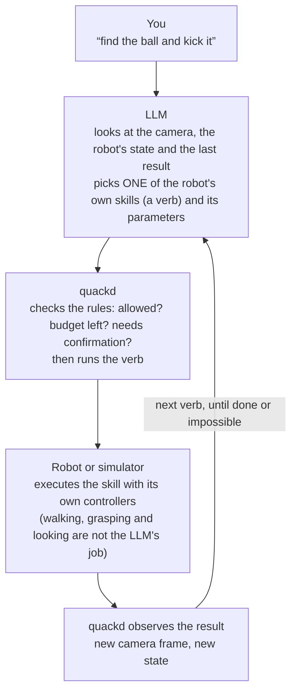
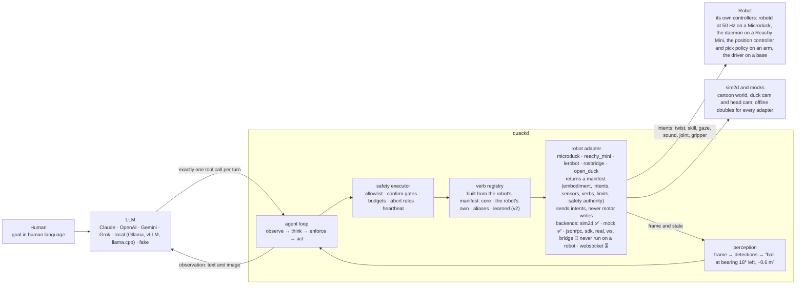
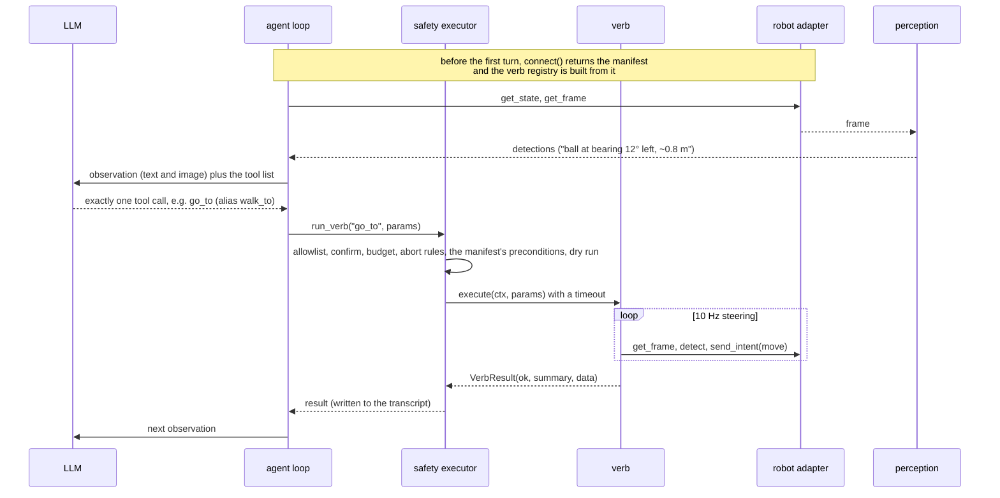

<p align="center">
  
</p>

<p align="center"><strong>Give your Microduck a brain. Your Open Duck Mini, your Reachy Mini, your arm and your wheeled base too. Any LLM, one <code>.duck</code> file.</strong> 🦆🧠<br>
<sub>quackd, pronounced “quacked”. The brain daemon Microduck was missing, named like its siblings <code>robotd</code>, <code>mediad</code>, <code>padd</code> and <code>tofd</code>. Since 0.4 it drives other small robots too, and since 0.5 one of them is a duck you can print and build yourself.</sub></p>

<p align="center">Type a goal in a terminal, or just chat with it through Claude. Same rules either way.</p>

<p align="center">
  <a href="https://github.com/rokbenko/quackd/actions/workflows/ci.yml"></a>
  <a href="https://pypi.org/project/quackd/"></a>
  <a href="https://pypi.org/project/quackd/"></a>
  <a href="LICENSE"></a>
  <a href="docs/mcp.md"></a>
  <a href="docs/adapter-status.md"></a>
  <a href="https://github.com/pollen-robotics/microduck#readme"></a>
</p>

<details>
<summary>Hey, my name is Rok and this is why I built quackd 👋</summary>

> I see quackd as a ChatGPT like moment for robotics. Let me explain what I mean.
>
> LLMs existed long before ChatGPT. What ChatGPT actually did was take LLMs and hand them to ordinary people in a chat interface everyone already knew, like Facebook Messenger or Instagram. That was the real unlock.
>
> Right now, in 2026, most people still think robots belong in science fiction movies or in a lab at Tesla. That is not true anymore. There are already open source robots you can build yourself for under $1000. And they actually work. They can go to your fridge, open it, grab a can of Coke, close the fridge and bring it to you.
>
> The problem is they have a huge limitation. You can teach them dozens of moves, like "get a coke". But the robot itself is still dumb. It knows the moves, it just cannot connect them on its own. For robots to become truly useful, they need to become AI first and agentic. You give them a goal and they figure out the steps themselves.
>
> Imagine telling your robot "I want to eat and drink something". It walks to the fridge, checks what is inside, finds your Coke, grabs a plate and some cutlery, brings them to you, and at the same time tells you what food it found so you can pick. You choose, it goes back, gets the food, brings it to you and wishes you a good meal. Sounds like science fiction, right? We are closer than you think!
>
> To get there, robots need a brain. And here is the catch. Today's robots simply do not have enough hardware on board to think, reason and plan. Their skull is too small for the brain this kind of intelligence needs.
>
> This is exactly where quackd comes in. It gives your robot a brain that lives outside of it, in the cloud or on your own computer, and that brain can grow as big as you need. The robot itself stays small and light while all the heavy thinking happens somewhere else.
>
> Now the only thing left to solve is the interface. quackd lets you talk to that outside brain, and through it to your robot, using a simple chat, the same kind of chat you already use on Messenger or Instagram. You just say "hey, I want to eat something" and it takes it from there.
>
> That is basically what ChatGPT did for LLMs. And that is why I see quackd as a ChatGPT like moment for robotics.
>
> — Rok Benko, August 2026

</details>

<p align="center">
  
  <br>
  <sub>"Find the ball and kick it", in the bundled simulator, driven by the <em>scripted</em> pilot (no API key). Same verbs, same safety layer, same perception as a real model run. See <a href="docs/assets/README.md">docs/assets</a>.</sub>
</p>

**quackd** connects a small robot to a large language model (Claude, OpenAI, Gemini, Grok, or an open source model running locally through llama.cpp, vLLM, Ollama or LM Studio). The first robot is the [Microduck](https://pollen-robotics.com/microduck/) from Pollen Robotics, a biped that already knows how to walk, turn, kick, scoop something off the floor, look around and quack. Since 0.4 the same loop drives other bodies through adapters that declare what each can do, and 0.5 adds the [Open Duck Mini v2](https://github.com/apirrone/Open_Duck_Mini), an open hardware biped you can print and build yourself, which makes it the one robot here you can own today. A Reachy Mini head, an SO-101 class arm through LeRobot and any wheeled base over rosbridge come along too. quackd is the missing layer that turns a request like *"find the ball and kick it"* into the right sequence of a robot's own skills, watches what happens, and keeps going until the job is done or it is clearly impossible.

You do not need a robot to try it. A bundled simulator runs on any laptop in seconds. Goals proven today, in that simulator, on 10 of 10 seeds with the scripted pilot and a ground truth check:

> **"Find the ball and kick it."** · **"Find the ball, walk up to it and say where it is."** *(an Open Duck Mini v2, which cannot kick)* · **"Find the ball with your gaze and say where it is."** *(a Reachy Mini head, no legs)* · **"Split the search, the closest duck kicks."** *(a flock)* · **"The head spots, the duck kicks, the head judges."** *(two bodies, one contract)*

Five more starters ship. `hello-world` is the smoke test (quack, one step, quack) and the scripted pilot completes it, and `open-duck-lookout` stands still and reports what it can see, which is the task to point at a real duck first because nothing in it moves a leg. `patrol-and-quack`, `follow-me` and `fetch` carry a strategy in their body written for a real model, and no pilot has completed one yet: the scripted pilot has no script for `follow-me` or `fetch` (it declares success after two steps without attempting the task), its patrol script runs to the budget on every seed, and no model run has been recorded.

Runs with a cloud model or with an open source model on your own machine (Ollama, vLLM, llama.cpp, LM Studio). The local path needs no API key.

Goals like *"find my keys"* or *"pick up the trash"* are where this is going, **not** what it does yet. **Nothing here has run on a real robot, on any of the five adapters.** Microducks pre-ordered early are estimated to arrive around Christmas 2026, and later orders in four to six months. A Reachy Mini, an SO-101 arm and a rosbridge base exist today and quackd has only ever talked to fakes of them. An Open Duck Mini v2 you can build from scratch, and for that one quackd ships the daemon that runs on the robot and exercises the whole protocol against it over loopback, so everything except the duck is tested. The honest label for today is *LLM driven, goal directed control of simulated robots*: an early, working step toward a small robot you can simply talk to. [Which robots work](#which-robots-work) says exactly how far each one has got.

<br>

## Table of Contents

- [Try it in 60 seconds](#try-it-in-60-seconds)
- [Why?](#why)
- [What is this?](#what-is-this)
- [How it works (the simple version)](#how-it-works-the-simple-version)
- [Example](#example)
- [What it can do today, and where it is going](#what-it-can-do-today-and-where-it-is-going)
- [Which robots work](#which-robots-work)
- [Architecture](#architecture)
- [Installation](#installation)
- [Usage](#usage)
  * [The `.duck` file](#the-duck-file)
  * [Pilot it from Claude (MCP)](#pilot-it-from-claude-mcp)
  * [What it remembers](#what-it-remembers)
- [Any small robot](#any-small-robot)
- [Flock mode (simulator)](#flock-mode-simulator)
- [Configuration](#configuration)
- [Performance](#performance)
- [Limitations](#limitations)
- [Roadmap](#roadmap)
- [Contributing](#contributing)
- [Safety](#safety)
- [Acknowledgements](#acknowledgements)
- [Star history](#star-history)
- [License](#license)

<br>

## Try it in 60 seconds

```bash
uvx quackd run find-and-kick --provider fake                                        # no key: the scripted pilot
claude mcp add quackd -- uvx quackd serve-mcp --robot microduck:sim2d               # or just chat with it: "find the ball and kick it"
uvx quackd run open-duck-scout --provider fake                                     # a duck you can build: it finds the ball and walks up, no kick
uvx quackd run reachy-spotter --provider fake                                       # another body: a Reachy Mini head, no legs, same loop
uvx --from "quackd[anthropic]" quackd run find-and-kick --provider anthropic --robot microduck:sim2d   # needs ANTHROPIC_API_KEY
uvx --from "quackd[openai]" quackd run find-and-kick --provider ollama --model qwen3:8b          # local model, no key
open runs/*/run.gif                                                                 # a GIF on the simulator, a transcript every time
```

Put keys in the environment or in a `.env` file (copy [`.env.example`](.env.example)). `quackd doctor` tells you what is missing. Needs Python 3.11 or newer and [`uv`](https://docs.astral.sh/uv/), nothing else.

<br>

## Why?

A modern small robot is not short of skills. The Microduck's onboard controllers already balance it, walk, kick, sit, stand up after a fall and scoop with its beak. A Reachy Mini head looks around and emotes, an arm picks with its own learned policy, a wheeled base drives. Each is the robot's own skill, trained, written or recorded, and each works without any help from an AI model. What the robot lacks is any idea of **what those skills are for**.

```
Traditional control:   walk forward, turn left, walk, look down, scoop, ...   (you plan every step)
This project:          "Pick up the ball."                                    (you state the goal)
```

Low level skills and high level goals are different layers. The robot knows the words, but it cannot hold a conversation. quackd is an open source attempt to connect the two layers, with an LLM doing the planning and the robot's own controllers doing the moving.

<br>

## What is this?

**The first robot.** The Microduck is a 25 cm, 800 g biped shaped like a duck: fifteen small servos, a camera in its head, a depth sensor, a speaker, an onboard computer, and a set of learned behaviours (walk, kick, sit and stand, ground pick, roll, roller skate with clip on wheels) that run at 50 Hz on the robot itself. It is open source, costs about $399, and is deliberately small and friendly, the opposite of an intimidating humanoid. The bigger bet behind projects like this one is that *useful* robots at home or in an office will be small ones people actually enjoy having around.

**The other bodies.** Since 0.4 quackd also drives an Open Duck Mini v2 (a 42 cm 3D printed biped, the one robot here you can build yourself), a Reachy Mini (a stationary expressive head from the same company, with a camera, a neck, two antennas and a speaker, hardware that exists today), an SO-101 class desktop arm through LeRobot, and any wheeled base that takes a Twist over rosbridge, each in a simulator or a mock so far, never on the real thing. Each is an adapter that describes itself in a manifest, and the verbs the model can be offered come from that manifest and nowhere else: a head is never offered `kick`, an arm is never offered `move`, and `quackd validate --robot` tells you which verbs a task needs that the body lacks before a run starts. All five, side by side, in [Which robots work](#which-robots-work) and [Any small robot](#any-small-robot) below.

**This project.** quackd (pronounced "quacked", named after the Microduck's daemons `robotd`, `mediad`, `padd` and friends) is an independent, unofficial brain for it, and since 0.4 for any small robot that has an adapter. It is a Python program that

- takes a goal in human language, from a chat, a command line, or a `.duck` task file,
- reads what a robot can do from its adapter's manifest, so the model only ever sees the verbs that manifest declares, and a verb outside it does not exist,
- asks an LLM, cloud or local, one step at a time, which of the robot's skills to use next,
- runs that skill on the robot (or the simulator), looks at the camera, and asks again,
- enforces a contract the model cannot talk its way out of: which skills are allowed, how many steps, when a human must say yes, when to abort.

It ships with a cartoon simulator so all of this can be developed and demoed before the hardware exists, and with an [MCP](https://modelcontextprotocol.io) server so Claude Code or Claude Desktop can drive one robot or a fleet interactively.

<br>

## How it works (the simple version)



The verbs the model can pick from are real, existing capabilities and nothing more. They come from the robot's manifest. A verb not in the manifest does not exist:

| Kind | Verbs | What they are |
|---|---|---|
| Core | `observe` `report_state` `stop` `say` `move` `go_to` `search_scan` `approach_and` | on any robot whose manifest satisfies their requirements (a camera, a twist intent, a sound intent). `go_to` and `search_scan` are plain Python over the camera, the steering loop, clamped to the speed limits the manifest names. On a body that can only look, `search_scan` sweeps the head |
| Microduck | `sit` `stand` `stand_up` `kick` `grab` `gaze` `quack` | one each per behaviour the robot ships with, each an *intent* the robot's own controllers execute |
| Reachy Mini | `gaze` `express` `play_sound` `wake_up` | a stationary head that looks, expresses and plays sounds. `wake_up` moves every joint, so it is confirm gated. The SDK has no text to speech, so `say` is voiced as the closest expression |
| LeRobot arm | `move_joints` `gripper` `place` `pick` | an SO-101 class arm. `pick` is one skill intent the arm's own learned policy executes, confirm gated and present only when a policy is loaded |
| rosbridge base | *(core only)* | a wheeled base over ROS 2. It gets `move`, `stop` and `report_state`, plus `observe`, `go_to`, `search_scan` and `approach_and` once an image topic is configured |
| Aliases | `get_frame` `walk_to` `walk` | the 0.3 names of `observe`, `go_to` and `move`. They keep working in every `.duck` file |
| Learned | *(none yet)* | v2: policies trained from LLM written rewards, registered like any other verb |

`go_to` (still spelled `walk_to` in the starter files) deserves a mention. It is a small closed loop written in plain Python that steers toward whatever the camera sees, ten times a second, without asking the model. The LLM says *"go to the ball"*. It never has to say *"turn 4° left"*. The same code steers a duck and a wheeled base (the rosbridge mock so far), clamped to each manifest's speed limits. On a head that cannot walk, `go_to` does not exist and `search_scan` sweeps the head instead of turning the body.

<br>

## Example

The hero run above, from its transcript (`runs/<timestamp>-find-and-kick/transcript.jsonl`). This one is the scripted pilot, so `model` says so and `usage` is an estimate from character counts (no tokenizer). A real provider records the API's own counts.

```jsonc
{"kind": "llm",  "step": 0, "tool_calls": [{"name": "search_scan", "arguments": {"target": "ball"}}], "usage": {"input_tokens": 689, "output_tokens": 16}}
{"kind": "verb", "step": 1, "name": "search_scan", "ok": true, "summary": "ball found: ball at bearing 18° left ~0.58 m (after 4 turn steps)"}
{"kind": "llm",  "step": 1, "tool_calls": [{"name": "walk_to", "arguments": {"target": "ball", "stop_distance": 0.22}}]}
{"kind": "verb", "step": 2, "name": "walk_to", "canonical": "go_to", "ok": true, "summary": "reached the ball: ~0.22 m away, bearing +0°", "data": {"distance_m": 0.217, "ticks": 27}}
{"kind": "llm",  "step": 2, "tool_calls": [{"name": "kick", "arguments": {"leg": "right"}}]}
{"kind": "verb", "step": 3, "name": "kick", "ok": true, "summary": "kicked with right leg, ball moved 0.53 m"}
{"kind": "llm",  "step": 3, "tool_calls": [{"name": "quack", "arguments": {"text": "yay, got it!"}}]}
{"kind": "llm",  "step": 4, "tool_calls": [{"name": "declare_success", "arguments": {"reason": "ball displaced by the kick"}}]}
```

The same thing as a conversation, through MCP in Claude Code or Claude Desktop:

> **You:** List the duck's verbs, then find the ball and kick it.
> **Claude:** *(calls `robot_list_verbs`, `robot_observe`, `robot_run_verb("search_scan")`, `robot_run_verb("go_to")`, `robot_run_verb("kick")`, `robot_say`)* Done. The ball moved about half a metre.

The eight `duck_*` tools from 0.3 were aliases of the default robot and were removed in 0.5, as 0.4 said they would be. Omitting the `robot` argument does the same thing.

<br>

## What it can do today, and where it is going

**Today (v0.6, simulator and mocks):**

**Three demos to run right now, all scripted, all 10 of 10 seeds:** `find-and-kick`, one duck in the bundled simulator, `open-duck-scout`, an Open Duck Mini v2 that finds the ball and walks up to it because it has no kick, and `reachy-spots-duck-kicks`, a Reachy Mini head that spots and judges while a Microduck kicks, two bodies under one contract.

- Run a goal end to end in the bundled 2D simulator with any of the ten `--provider` names (four cloud, five local presets, and the scripted pilot). `find-and-kick` succeeds on 10 of 10 seeds with the scripted pilot, in about 2 s of wall clock per run, with a GIF and a full transcript every time.
- A vocabulary per body, built from its manifest: eight core verbs that a manifest may name only when the body has what they need (a camera for `observe`, the `twist` intent and mobility for `move`), plus each robot's own. Fifteen on the Microduck (eight core, seven of its own), eleven on an Open Duck Mini v2, nine on a Reachy Mini head, seven on a LeRobot arm with a camera and a pick policy (five with neither), seven on a wheeled base with a camera topic (three without). A strict `.duck` task file format (v1 adds `requires`, `robots` and `flock.roles`) with a validator that checks a task against a robot's manifest, and a safety layer that enforces allowlists, budgets, confirmation gates, a heartbeat and a kill switch.
- Drive a robot interactively from Claude Code or Claude Desktop over MCP, under the same rules. `serve-mcp --robots` fronts a fleet with one executor, budget and heartbeat per robot.
- Carry what a robot learned into the next run. Each `adapter:backend` keeps a small file of the notes the pilot saved with `remember` and one line per earlier run, and the newest of both open the next system prompt. `quackd memory show` prints exactly what the pilot was told, `--no-memory` runs fresh, and the same file sits behind `robot_recall` and `robot_remember` over MCP.
- Local and open source models through Ollama, vLLM, llama.cpp, LM Studio or any OpenAI compatible server, with no API key, model discovery from the server, and a JSON text fallback for models that cannot call tools natively.
- Real model code paths for Claude, OpenAI, Gemini and Grok are implemented and tested offline. The hero GIF is the scripted pilot because this repo was built without an API key.
- Run a flock: multiple simulated robots coordinate over a message bus and a deterministic auction, each acting only through the verbs it already has. Two choreographies ship today, `flock-kick` (ducks) and `reachy-spots-duck-kicks` (a head and a duck), both 10 of 10 seeds with the scripted pilots, and every message lands in `flock.jsonl`.
- Drive other bodies. Robots are adapters that declare a manifest, and the verbs come from the manifest. Five adapters ship: the Microduck, an Open Duck Mini v2 that runs `open-duck-scout` in the simulator on 10 of 10 seeds, a Reachy Mini head that runs `reachy-spotter` on 10 of 10, an SO-101 class arm through LeRobot and any wheeled base over rosbridge, the last two as offline mocks, each with an experimental backend (`open_duck:bridge`, `reachy_mini:sdk`, `lerobot:real`, `rosbridge:ws`) that has never run against its target. `quackd list-adapters` shows them, `quackd list-verbs --robot` shows a body's vocabulary, and `quackd validate --robot` tells you which verbs a task needs that a robot does not have.
- Mix bodies in one flock. In `reachy-spots-duck-kicks` a Reachy Mini head spots the ball and judges the kick from its own frames while a Microduck kicks, 10 of 10 seeds with the scripted pilots, with bids that carry a capability term so each robot only bids for a role its manifest can fill.
- Find robots on the LAN with `quackd discover` and `quackd announce` (zeroconf, behind `quackd[lan]`), and carry a flock's messages over an MQTT broker as a library. Each was exercised once for real on one machine, never across two.

**Going (see [Roadmap](#roadmap)):** a first run of `open_duck:bridge` on a duck somebody built, which is the nearest of these and the one with a checklist waiting for it, then `reachy_mini:sdk`, `lerobot:real` and `rosbridge:ws` on the bodies they target, the five Microduck starter tasks on a real duck once it ships, upstream's WebSocket agent surface, and *learned verbs*, new skills trained from LLM written rewards that register as one more verb. Eventually, a small robot in a real room that you can ask to find, fetch, follow and check on things.

| Piece | Status |
|---|---|
| `sim2d` bundled simulator (default) | ✅ 10 of 10 seeds on `find-and-kick`, GIF and transcript per run |
| Manifests and core verbs (`quackd list-adapters`, `quackd list-verbs --robot`) | ✅ five adapters, eight core verbs that appear only where the manifest meets their requirements, speed limits from the manifest, `manifest.schema.json` generated and drift tested |
| MCP server (`quackd serve-mcp`) | ✅ Claude Code and Claude Desktop, the Claude Code config checked against its docs (2026-08), no Claude Desktop session on record, fleets with `--robots` (eight `robot_*` tools, tested in process against the simulator and the mocks) |
| Memory between runs (`quackd memory`, `remember`) | ✅ one JSONL file per `adapter:backend`, notes and run outcomes into the next prompt, tested end to end offline, 🧪 the `remember` tool itself exercised by one local model on one machine and by no cloud model ([docs/memory.md](docs/memory.md)) |
| Providers: anthropic, openai, gemini, grok, fake | ✅ implemented, tested offline, real model hero recording pending an API key |
| Local models (Ollama, vLLM, llama.cpp, LM Studio, any OpenAI compatible server) | ✅ implemented and tested against the OpenAI wire format, 🧪 one live run by a contributor (Qwen 2.5 Coder 14B on LM Studio, two seeds), never on this machine and no transcript in the repo, more welcome |
| Flock mode (multiple cooperating robots, sim2d) | ✅ deterministic auction and bus, one planner LLM call at most, ground truth checked in tests, 🧪 experimental and simulator only |
| Real Microduck over JSON RPC (`--robot microduck:jsonrpc`) | 🧪 experimental, method names verified against upstream `duck-ipc-proto` v16, never run on hardware |
| WebSocket agent gateway (`--robot microduck:websocket`) | ⏳ stub tracking upstream's draft ([architecture.md §5.3](https://github.com/pollen-robotics/microduck/blob/main/docs/design/architecture.md)) |
| Reachy Mini adapter (`--robot reachy_mini:sim2d`, `mock`, `sdk`) | ✅ sim2d and mock, `reachy-spotter` 10 of 10 seeds, 🧪 sdk behind `quackd[reachy]` with every SDK name verified against a pinned commit and the 1.10.0 wheel, exercised with a fake client, never run on a robot ([docs/adapters/reachy_mini.md](docs/adapters/reachy_mini.md)) |
| LeRobot adapter (`--robot lerobot:mock`, `real`) | ✅ mock, an SO-101 class arm with `move_joints`, `gripper`, `place` and `pick` as one skill intent (confirm gated, present only when a policy is available), 🧪 real behind `quackd[lerobot]` (Python 3.12 or newer) with every LeRobot name verified against a pinned commit, exercised with a fake arm and a fake policy, never run on an arm ([docs/adapters/lerobot.md](docs/adapters/lerobot.md)) |
| rosbridge adapter (`--robot rosbridge:mock`, `ws`) | ✅ mock, a wheeled base with `move`, `observe`, `go_to`, `search_scan` and `approach_and` (on `ws` the camera verbs appear only when the address names an image topic), no deadman verified anywhere in the stack so quackd re-sends the Twist at 10 Hz and zeroes it on stop, 🧪 ws via roslibpy behind `quackd[rosbridge]` with every roslibpy, rosbridge and message name verified against pinned commits, exercised with fake topics, never run against a bridge ([docs/adapters/rosbridge.md](docs/adapters/rosbridge.md)) |
| Open Duck Mini v2 adapter (`--robot open_duck:sim2d`, `mock`, `bridge`) | ✅ sim2d and mock, `open-duck-scout` 10 of 10 seeds, an open hardware biped you can build today, with no kick, no gripper, no sit and no way back up after a fall, so those verbs are never declared for it, 🧪 bridge through a daemon quackd ships for the duck's own Raspberry Pi, every runtime name verified against a pinned commit, the protocol exercised end to end against that daemon over loopback, never run on a duck ([docs/adapters/open_duck.md](docs/adapters/open_duck.md)) |
| Heterogeneous flock (a Reachy Mini head and a Microduck, sim2d) | ✅ `reachy-spots-duck-kicks` 10 of 10 seeds, capability aware auction, the spotter judges from its own frames, ground truth vetoes, 🧪 simulator only |
| LAN discovery (`quackd discover`, `quackd announce`, `quackd[lan]`) | ✅ record format and both commands on fakes in the suite, 🧪 real zeroconf exercised once on one Windows machine (a child process announced a mock manifest, the parent found it, digest matched), never between two machines ([docs/lan.md](docs/lan.md)) |
| MQTT flock bus (`MqttBus`, library only) | ✅ every message kind, echo, duplicates and a full flock run on a fake broker, 🧪 all eight kinds once between two nodes through a local `amqtt` broker on one machine, never a flock across machines (no distributed clock yet) ([docs/lan.md](docs/lan.md)) |
| Learned verbs | 🗺️ v2, interface and docs only ([docs/learned-verbs.md](docs/learned-verbs.md)) |

Everything quackd assumes about each robot's API, and how sure we are: [docs/adapter-status.md](docs/adapter-status.md). `quackd doctor` prints the same lists for your machine. Adding a body of your own takes a manifest and a mock: [docs/adapters.md](docs/adapters.md), with the manifest fields in [docs/manifest-spec.md](docs/manifest-spec.md).

<br>

## Which robots work

Five robots, and one table for how far each one has actually got. The distinction that matters is between code we have run and hardware we have not: **no robot of any kind has run quackd**, so the honest question is how much of the path to one is tested.

| How far it has got | What that means |
|---|---|
| ✅ **simulator** | Runs a whole task in the bundled 2D simulator, with a seeded acceptance sweep in CI that checks the simulator's ground truth, not the model's claim |
| ✅ **mock** | Every verb runs offline against a scripted double, in the test suite |
| 🧪 **daemon** | The wire protocol runs end to end against the real on-robot daemon over loopback in CI. Everything except the robot is exercised |
| 🧪 **names** | Every upstream name read from upstream source at a pinned commit, exercised against fakes. Never connected to anything real |
| ⏳ **stub** | Refuses with a link, waiting for upstream to ship the thing it would talk to |

| Robot | `--robot` | The body | How far it has got |
|---|---|---|---|
| **Microduck** | `microduck:sim2d`, `mock` | a 25 cm biped from Pollen Robotics | ✅ simulator, ✅ mock |
| | `microduck:jsonrpc` | the real one, over `robotd` | 🧪 names. Early pre-orders arrive around Christmas 2026, later orders in four to six months |
| | `microduck:websocket` | upstream's planned agent gateway | ⏳ stub |
| **Open Duck Mini v2** | `open_duck:sim2d`, `mock` | a 42 cm 3D printed biped you can build yourself | ✅ simulator, ✅ mock |
| | `open_duck:bridge` | the real one, through a daemon quackd ships for its Raspberry Pi | 🧪 daemon. **The nearest of these to a first real run**, because the hardware is buildable today ([checklist](docs/open-duck-hardware-checklist.md)) |
| **Reachy Mini** | `reachy_mini:sim2d`, `mock` | a stationary expressive head, no legs | ✅ simulator, ✅ mock |
| | `reachy_mini:sdk` | the real one, over its own daemon | 🧪 names, behind `quackd[reachy]` |
| **LeRobot arm** | `lerobot:mock` | an SO-101 class desktop arm | ✅ mock |
| | `lerobot:real` | the real one, through LeRobot | 🧪 names, behind `quackd[lerobot]`, Python 3.12 or newer |
| **Any ROS base** | `rosbridge:mock` | any wheeled base that takes a Twist | ✅ mock |
| | `rosbridge:ws` | the real one, over `rosbridge_server` | 🧪 names, behind `quackd[rosbridge]` |

<p align="center">
  
  <br>
  <sub><code>open-duck-scout</code> on <code>open_duck:sim2d</code>, seed 3, driven by the <em>scripted</em> pilot. It finds the ball and walks up to it, because this duck has no kick.</sub>
</p>

**If you own one of these, the Open Duck Mini is where help is worth the most.** It is the only body in the table a stranger can build from scratch, the daemon and the protocol are already exercised against each other, and the only untested part left is the duck. [docs/open-duck-hardware-checklist.md](docs/open-duck-hardware-checklist.md) is the order to try it in, feet off the ground until step 10.

<br>

## Architecture

Three loops, three rates, three owners. The LLM decides **what**. The steering loop decides **how to get there**. The robot's own controllers do the **moving**: balance on a biped, a pick policy on an arm, the base's driver on a wheeled base.

quackd's own process, deliberation and perception both, runs off the robot itself, on your laptop or in the cloud: the only quackd code that ever runs on a robot's own computer is the pair of thin daemons on the Open Duck Mini's Pi, a bridge and a camera server, and neither does any perception or inference of its own ([`bridge/open_duck/`](bridge/open_duck/README.md)).

| Loop | Rate | Where | Who |
|---|---|---|---|
| Reflexes | the body's own (50 Hz on both ducks) | below quackd: `robotd` on a Microduck, quackd's own bridge daemon on an Open Duck, the daemon of a Reachy Mini, the position controller of an arm, the driver of a base | the robot's own controllers: RL policies (ONNX) for balance, gait and stand up on both ducks, a learned pick policy on the arm when one is loaded. quackd writes none of this control code. On the Open Duck it does host the loop, because that robot has no network API to talk to, and even there the command it feeds in is the same seven numbers a gamepad would send (ADR-0024) |
| Steering | 10 Hz | quackd process | perception and composite verbs. `go_to` (still `walk_to` in the starter files) closes the approach loop from detections, and `search_scan` turns the body when the manifest lets it move, otherwise it sweeps the head |
| Deliberation | 0.2 to 1 Hz | LLM | reads a frame and the state, picks the next **verb**, judges the success criteria |

Since 0.4 the robot is an *adapter* that declares a *manifest*: what body it has, which intents and sensors, which verbs, what stops it. The registry, the tool list, the verbs a `.duck` may allow and the system prompt are built from that manifest when the robot connects. A verb that is not in it does not exist. The Microduck adapter wraps the four transports below unchanged. The Open Duck Mini, Reachy Mini, LeRobot and rosbridge go through the same loop, executor and contract ([ADR-0017](docs/adr/0017-robot-adapters-and-manifest.md), [ADR-0024](docs/adr/0024-open-duck-mini.md)).



**One turn, concretely.**



**Why predefined skills matter.** The LLM never generates motor commands. Every built in verb is an *intent* the robot already understands: a velocity, a named skill (`kick_left`, `ground_pick` and `sit_toggle` on the Microduck, a recorded expression or `wake_up` on the Reachy Mini, `pick` as a LeRobot policy on the arm), a gaze target, a sound, a joint goal, a gripper command. The robot's own controllers do the physical part: on the Microduck, policies trained in [microduck_rl](https://github.com/pollen-robotics/microduck_rl), exported to ONNX, `obs[61] → act[14]` at 50 Hz, on the Reachy Mini the SDK's recorded moves, on the arm its own position controller or a LeRobot policy, on a base its driver. A slow or confused model degrades the *task*, never the *balance*, and where a deadman exists it stops itself when commands stall. The Microduck's `robotd` has one. On the Open Duck quackd's own daemon is the deadman, running on the robot and zeroing the velocity inside the 50 Hz loop. On the other three none was found, so quackd's heartbeat and `stop` are the only stop authority there. The LLM names the skill, the body performs it.

**Enforcement order.** `Executor.run_verb` applies the contract in this order: abort flag, allowlist, parameter validation (errors go back to the model as feedback), confirm gate, budgets, machine enforced `abort_when`, preconditions, dry run, then execution with a timeout. Preconditions are named in the manifest and supplied by the adapter, the executor spells none. On the Microduck that means not fallen and standing, on the Reachy Mini motors enabled, on the LeRobot arm torque on or something held. Every result is written to the transcript and becomes the next observation.

**Prompts.** The system prompt opens with the robot's own one line introduction from its manifest (the duck, the head, the arm and the rosbridge base each describe themselves), then the contract in prose (allowed verbs, budgets, confirm list, success criteria, the enforced and advisory abort conditions, the persona) followed by the `.duck` body verbatim. Tools are JSON schema definitions generated from each verb's parameter model, plus `declare_success(reason)` and `declare_failure(reason)`. The model must return exactly one tool call (`tool_choice=any` with parallel calls disabled on Claude, `tool_choice=required` on OpenAI and Grok, `auto` on the local presets unless `QUACKD_TOOL_CHOICE` says otherwise, `mode=ANY` on Gemini). Only the last two observations keep their images. For local models the prompt adds one line with the exact JSON shape to answer with if native tool calling is unavailable, and quackd parses that shape back into a verb. Everything is in [`quackd/agent/prompts.py`](quackd/agent/prompts.py).

**Perception: features, not frames.** The default detector is an HSV colour threshold, about 1 ms per frame, no model download. Bearing comes from horizontal position through the camera's focal length. Distance comes from apparent size. The simulator draws the ball in a known orange, so it works out of the box. For a real ball you tune one HSV range ([FAQ](docs/faq.md)). A YOLO detector is an optional extra. Composite verbs steer on these detections at 10 Hz and never wait for the model.

**Talking to the robots.** Each adapter speaks its body's own protocol and spells every upstream name in one `upstream_api.py`, tagged VERIFIED (read from upstream source, the four added since 0.4 at a pinned commit) or UNVERIFIED, and a test proves the unverified ones are only reachable from the experimental backends. The Microduck's `robotd` speaks JSON RPC 2.0, one object per line, over a unix socket: quackd sends `robot.move` as a *notification* every 100 ms while walking (the robot zeroes velocity if these stop, its deadman, kept on purpose), `robot.do{skill}`, `robot.look`, `robot.sound{tag}`, and polls `robot.health` every 500 ms as its heartbeat. The Reachy Mini is driven through the `reachy-mini` SDK, where `stop` is `cancel_move` and `disable_motors` is never sent. The arm goes through LeRobot with `calibrate=False`, refuses an uncalibrated arm, holds position on `stop` and never calls `disable_torque` itself (LeRobot's own `disconnect()` still lets the arm go limp at session end, by its default). The rosbridge base gets a `geometry_msgs/msg/Twist` through roslibpy, re-sent at 10 Hz and zeroed on `stop`, because no deadman was verified on that side. The Open Duck Mini has no network API at all, so quackd ships a small daemon for its Raspberry Pi that replaces the gamepad the walk loop reads and speaks a protocol quackd defines at both ends. Every name is tabulated in [docs/adapter-status.md](docs/adapter-status.md), the four bodies added since 0.4 each have a page under [docs/adapters/](docs/adapters/), and none of the five hardware backends (`microduck:jsonrpc`, `open_duck:bridge`, `reachy_mini:sdk`, `lerobot:real`, `rosbridge:ws`) has been run against its real target by us.

**Safety layer.** Heartbeat failure means `stop` plus abort. Ctrl+C or `q` means `stop` plus abort. A verb timeout or exception means `stop` plus a failed result. `--dry-run` sends nothing. `stop` always means stop, never collapse: quackd never sends `robot.relax` to a Microduck, `disable_motors` to a Reachy Mini or `disable_torque` to an arm. What stops a body when quackd goes quiet differs, and each manifest declares it in `safety_authority`. On a Microduck the gamepad keeps authority and `robotd` zeroes velocity when intents stop. An arm holds its position. A Reachy Mini or a base over rosbridge has nothing native we verified, so there quackd's heartbeat and `stop` are the only authority. Details: [docs/safety.md](docs/safety.md).

The full map, with a "why it exists" line per module: [docs/architecture.md](docs/architecture.md). Decisions and their reasons: [docs/adr/](docs/adr/).

<br>

## Installation

Requirements: Python 3.11 or newer and [`uv`](https://docs.astral.sh/uv/). Windows, macOS and Linux. No GPU. The default install is about 250 MB (OpenCV is most of it). Provider SDKs, robot SDKs and the LAN libraries are optional extras, so `uvx` stays fast and the default install never imports a robot SDK. `quackd[lerobot]` needs Python 3.12 or newer.

```bash
uvx quackd --version                                   # nothing to install, uvx fetches it
uv pip install "quackd[anthropic]"                     # or: openai, gemini, grok, all, yolo, live
uv pip install "quackd[reachy]"                        # or: lerobot (Python 3.12+), rosbridge, lan (zeroconf and MQTT). Never imported by default
git clone https://github.com/rokbenko/quackd && cd quackd && uv sync --extra dev   # contributors
```

<br>

## Usage

```bash
# a goal in human language (bundled simulator, scripted pilot, no key needed)
uvx quackd run --goal "find the ball and kick it" --provider fake

# the same goal with Claude
uvx --from "quackd[anthropic]" quackd run --goal "find the ball and kick it" --provider anthropic

# a task file (ten ship with the package, the starter table below lists them)
uvx quackd run find-and-kick --provider fake --seed 3
```

Every run writes `runs/<timestamp>-<name>/` (`--runs-dir` replaces `runs/`) with `transcript.jsonl` (every prompt, tool call, result and token count, plus the robot's manifest in `run_start`), the frames the model saw, `summary.json`, and `run.gif` on the simulator.

Cloud or local, same command.

| Provider | Extra | Key | Run |
|---|---|---|---|
| Claude | `quackd[anthropic]` | `ANTHROPIC_API_KEY` | `uvx --from "quackd[anthropic]" quackd run find-and-kick --provider anthropic` |
| OpenAI | `quackd[openai]` | `OPENAI_API_KEY` | `uvx --from "quackd[openai]" quackd run find-and-kick --provider openai` |
| Gemini | `quackd[gemini]` | `GEMINI_API_KEY` | `uvx --from "quackd[gemini]" quackd run find-and-kick --provider gemini` |
| Grok | `quackd[grok]` | `XAI_API_KEY` | `uvx --from "quackd[grok]" quackd run find-and-kick --provider grok` |
| fake (scripted) | none | none | `uvx quackd run find-and-kick --provider fake` |
| Ollama (local) | `quackd[openai]` | none | `uvx --from "quackd[openai]" quackd run find-and-kick --provider ollama --model qwen3:8b` |
| vLLM (local) | `quackd[openai]` | none | `uvx --from "quackd[openai]" quackd run find-and-kick --provider vllm --model Qwen/Qwen3-8B` |
| llama.cpp (local) | `quackd[openai]` | none | `uvx --from "quackd[openai]" quackd run find-and-kick --provider llamacpp` |
| LM Studio (local) | `quackd[openai]` | none | `uvx --from "quackd[openai]" quackd run find-and-kick --provider lmstudio` |
| any OpenAI compatible server | `quackd[openai]` | optional | `uvx --from "quackd[openai]" quackd run find-and-kick --provider local --base-url http://host:8000/v1` |

The four cloud providers see the camera frame as an image. Local models get the text detections by default and the frame too with `--vision`. The scripted pilot only reads the detection summary. Local setup, tool calling flags per server and what to expect from small models: [docs/local-llms.md](docs/local-llms.md).

| Command | What it does |
|---|---|
| `quackd run <duck>` or `quackd run --goal "..."` | Run a task. `--provider`, `--robot <adapter>:<backend>`, `--robots name=<adapter>:<backend>,...` for a flock of mixed bodies, `--address` for a real robot, `--model`, `--seed`, `--max-steps`, `--dry-run`, `--yes`, `--live`, `--gif-size`, `--camera-url` for a robot whose camera is an HTTP snapshot, `--token` for a robot that wants one, `--flock N` (2 to 4, sim2d), `--no-memory` and `--memory-dir` for what it carries between runs |
| `quackd validate ducks/*.duck` | Check task files against the spec and a robot's manifest (`--robot`, repeatable, `--robots` for a fleet, or the file's own `robots:` if it has one). Exits 1 with field level errors such as `requires kick, but reachy-01 (reachy-mini) does not provide it` |
| `quackd serve-mcp` | Expose a robot (`--robot <adapter>:<backend>`), or a fleet with `--robots name=<adapter>:<backend>,...`, as MCP tools over stdio. `--duckfile` starts with a contract loaded on the default robot, `--yes` allows confirm-gated verbs, `--seed`, `--address`, `--dry-run`, `--no-memory` and `--memory-dir` |
| `quackd doctor` | Keys, extras, adapters, local LLM servers, and every upstream assumption on this machine (`--robot` for one robot's manifest) |
| `quackd list-verbs` | The vocabulary with parameters and safety classes (`--robot` for another robot) |
| `quackd list-adapters` | The robot adapters this build knows, their backends and status |
| `quackd discover` | The quackd robots answering on the LAN (zeroconf, needs `quackd[lan]`). `--timeout` seconds to listen, `--json` one object per robot. See [docs/lan.md](docs/lan.md) |
| `quackd announce --robot <adapter>:<backend>` | Advertise a robot's identity on the LAN (a static manifest, no robot connection). `--name` sets the manifest id, `--for` seconds to stay announced, default until Ctrl+C |
| `quackd memory show\|add\|clear` | What one robot remembers between runs: the notes a pilot saved and how recent runs ended. `--robot` picks the body, `--raw` prints the file, `--memory-dir` points elsewhere, `clear --yes` skips the prompt. See [docs/memory.md](docs/memory.md) |
| `quackd record <duck>` | `run` pinned to `microduck:sim2d` (no `--robot`) that always writes a GIF. `--seed` defaults to 0 and gated verbs are auto accepted, as with `--yes` |

### The `.duck` file

A task file is a contract plus instructions, deliberately shaped like a SKILL.md. The YAML frontmatter is **enforced by quackd**. The Markdown body is **read by the model**.

```markdown
---
duck: 0
name: find-and-kick
description: Search the area for a ball, walk to it, kick it.
verbs:
  allow: [search_scan, walk_to, kick, quack, get_frame, stop]
  confirm: []                       # verbs that ask a human y/N first
budgets: {max_steps: 40, max_minutes: 5, max_llm_calls: 40}
success:
  - Ball displaced more than 0.3 m in sim, or human confirms the kick landed.
abort_when: [Battery below 15%, Same verb fails 3 times in a row]
persona: Determined and cheerful. Quack once when you succeed.
---
# Task
Find the ball and kick it.
## Strategy
1. `search_scan`. 2. `walk_to` the ball, stop ~0.25 m away. 3. `kick`. 4. Verify, and retry if it did not move.
```

That is a `duck: 0` file, the contract since 0.1, and every bundled v0 file still parses. Since 0.4 a `duck: 1` file can also say which body it is for and what it truly needs:

```yaml
duck: 1
robots: microduck:sim2d                 # the default body, so `quackd run` needs no --robot (or one robot per flock member)
requires: [search_scan, walk_to, kick]  # the honest minimum a body must provide
```

`quackd validate --robot` checks `requires` against a robot's manifest before anything moves: `quackd validate find-and-kick --robot reachy_mini:mock` exits 1 with `requires kick, but reachy-01 (reachy-mini) does not provide it`. For a `duck: 0` file the whole allowlist counts as required. Of the bundled starters, `reachy-spotter`, `reachy-spots-duck-kicks`, `open-duck-scout` and `open-duck-lookout` are `duck: 1`, and the Microduck ones keep their 0.3 spellings at `duck: 0`.

| Starter | Goal | Notes |
|---|---|---|
| `hello-world` | quack, one step forward, quack | the smoke test |
| `find-and-kick` | find the ball and kick it | the flagship, ground truth checked in tests |
| `patrol-and-quack` | wander, quack twice on a person or pet | the scripted pilot quacks at the sighting but hits its budget on seeds 0 to 9, no pilot has completed it yet |
| `follow-me` | keep a person in view and follow at 0.5 m | the scripted pilot has no strategy for it and declares success after two steps without a single `walk_to`, no real model run yet |
| `fetch` | scoop the ball up and bring it back | **experimental**, the scoop is open loop and fails about 40 % of the time in sim, by design, and the scripted pilot has no strategy for it either, it declares success after two steps without a `grab`, no real model run yet |
| `flock-kick` | multiple ducks split the search, the closest one kicks | **flock mode**, cooperation over a bus and an auction |
| `reachy-spotter` | find the ball with your gaze and say where it is | **Reachy Mini** (`--robot reachy_mini:sim2d` is its default), a stationary head with no legs |
| `reachy-spots-duck-kicks` | a Reachy Mini head spots the ball, a Microduck kicks it, the head judges the kick | **heterogeneous flock**, two bodies under one contract, the spotter judges and the world vetoes |
| `open-duck-scout` | find the ball, walk up to it, say where it is | **Open Duck Mini v2** (`--robot open_duck:sim2d` is its default), the kick free shape of `find-and-kick`, ground truth checked on 10 of 10 seeds |
| `open-duck-lookout` | stand still, look around, say what you can see | **Open Duck Mini v2**, and the task to point at a real duck first: nothing in its allowlist moves a leg, and it works on a duck with no head at all |
| `microduck-lookout` | stand still, look around, say what you can see | the same idea for a **Microduck**: the task to point at real hardware first, since nothing in its allowlist moves a leg. It copes with having no camera, and it stops and says so if posture reads `unknown`, which is the one thing worth knowing before letting the duck walk. See [docs/microduck-hardware-checklist.md](docs/microduck-hardware-checklist.md) |

Full spec: [docs/duck-spec.md](docs/duck-spec.md). Add yours to [`ducks/`](ducks/).

### Pilot it from Claude (MCP)

```bash
claude mcp add quackd -- uvx quackd serve-mcp --robot microduck:sim2d
```

Then, in Claude Code or Claude Desktop: *"List the duck's verbs, then find the ball and kick it."* The same allowlists and budgets apply once you load a `.duck`, or start with `--duckfile`. Pass `--robots duck=microduck:sim2d,reachy=reachy_mini:mock` to front a fleet, with one executor, budget and heartbeat per robot. Simulated robots in a fleet each get their own world (a shared arena over MCP is future work), so for two bodies on one task use `quackd run reachy-spots-duck-kicks`. Config for both clients, the eight `robot_*` tools, and a two minute script: [docs/mcp.md](docs/mcp.md).

<br>

### What it remembers

A run no longer starts from nothing. Each robot (keyed `adapter:backend`, so the simulator
and a real duck keep separate files) has a small memory under `~/.quackd/memory/`: the
notes the pilot saved with the `remember` tool, and one line per earlier run that quackd
writes itself (outcome, reason, the last few verb results). The newest of both go into the
system prompt at the next run, and `remember` costs no step. `quackd memory show`, `add`
and `clear` manage it, and `--no-memory` runs fresh. Over MCP the same file sits behind
`robot_recall` and `robot_remember`. Details and what it is *not* (a learning loop, a
search index): [docs/memory.md](docs/memory.md).

<br>

## Any small robot

Since 0.4 the Microduck is one body among several. A robot joins quackd as an **adapter** that answers one question, what is this body and what can it do, as a **manifest**: its embodiment, the intents its controllers accept (a velocity, a named skill, a gaze, a sound, a joint goal, a pose, a gripper), its sensors, the limits its verbs clamp to, who stops it when quackd goes quiet, and its verbs. The verb list the model sees is built from that manifest and nothing else, so a head is never offered `kick`, an arm is never offered `move`, and `quackd validate --robot` fails a `.duck` that needs a verb the body lacks before anything moves. Everything else (the loop, the executor, the contract, the MCP server, flocks) is shared.

| `--robot` | Body | Verbs it gets | Runs today |
|---|---|---|---|
| `microduck:sim2d`, `mock`, `jsonrpc`, `websocket` | the duck, a 25 cm biped | the eight core verbs plus `sit` `stand` `stand_up` `kick` `grab` `gaze` `quack` | ✅ sim2d and mock, 🧪 jsonrpc never run on a duck, ⏳ websocket |
| `open_duck:sim2d`, `mock`, `bridge` | an Open Duck Mini v2, a 42 cm 3D printed biped you can build yourself | the eight core verbs plus `gaze` `quack` `express`, and **no** `kick` `grab` `sit` `stand` `stand_up`, because this robot has none of them | ✅ sim2d and mock, 🧪 bridge never run on a duck |
| `reachy_mini:sim2d`, `mock`, `sdk` | a stationary expressive head, no legs | `observe` `report_state` `stop` `say` `search_scan` (a head sweep) `gaze` `express` `play_sound` `wake_up` | ✅ sim2d and mock, 🧪 sdk never run on a robot |
| `lerobot:mock`, `real` | an SO-101 class desktop arm | `report_state` `stop` `move_joints` `gripper` `place`, plus `observe` with a camera and `pick` with a policy (the mock has both) | ✅ mock, 🧪 real never run on an arm |
| `rosbridge:mock`, `ws` | any wheeled base that takes a Twist | `move` `stop` `report_state`, plus `observe` `go_to` `search_scan` `approach_and` with a camera topic | ✅ mock, 🧪 ws never run against a bridge |

```bash
uvx quackd list-adapters                                                # the table above, for your build
uvx quackd list-verbs --robot open_duck:sim2d                           # a buildable duck's vocabulary
uvx quackd run open-duck-scout --provider fake                          # it finds the ball and walks up, 10 of 10 seeds
uvx quackd run reachy-spotter --provider fake                           # a head finds the ball with its gaze, 10 of 10 seeds
uvx quackd validate ducks/find-and-kick.duck --robot open_duck:mock     # exit 1: requires kick, but open-duck-01 (open-duck-mini-v2) does not provide it
uvx quackd serve-mcp --robots duck=microduck:sim2d,arm=lerobot:mock     # a duck and an arm behind one MCP server
```

The three backends that need an SDK (`reachy_mini:sdk`, `lerobot:real`, `rosbridge:ws`) sit behind extras (`quackd[reachy]`, `quackd[lerobot]`, `quackd[rosbridge]`), import the SDK only on connect, spell every upstream name in one pinned `upstream_api.py`, and never use a body's go limp call as stop. `open_duck:bridge` needs no extra at all, because the part that touches the robot runs on the robot: quackd ships a small daemon for the duck's own Raspberry Pi, since its runtime has no network control API to talk to. Like `microduck:jsonrpc`, none of them has been run against its real target by us. Adding a body of your own takes a manifest and a mock, about a day: [docs/adapters.md](docs/adapters.md), the fields in [docs/manifest-spec.md](docs/manifest-spec.md), what has and has not run in [docs/adapter-status.md](docs/adapter-status.md).

<br>

## Flock mode (simulator)

Multiple simulated robots can work together. They talk to each other over a tiny message bus, divide up a job, and each contributes the skills it already has: walking, kicking, picking things up, looking around, quacking. The first choreography that ships is a kick: the flock splits the search for a ball, holds a quick auction, and the closest duck takes the shot.

```bash
uvx quackd run flock-kick --provider fake --seed 3
```

<p align="center">
  
  <br>
  <sub>The first choreography: one flock, one auction, one kicker. Scripted planner, deterministic coordinator. Every message is in the transcript.</sub>
</p>

The interesting part is not the kick, it is the talking. The ducks coordinate over an in process bus with eight message kinds (TASK, BID, CLAIM, ROLE, HINT, VERDICT, HB and RESULT), every one logged in `flock.jsonl`, and a deterministic Contract Net auction decides which duck acts, from each duck's own camera distance estimate. Every action goes through verbs the duck already has, so the machinery is task agnostic and what a flock can do is bounded by its skills, not by the ball. The kick is simply the first choreography written on top: split the search, auction, one actor, with the target label configurable. The LLM contributes **at most one** planning call per run, and each duck still enforces the `.duck` contract on itself. The outcome is judged from sim ground truth, not from a model's claim. Add a `flock:` block to any `.duck` or pass `--flock N` (2 to 4 ducks), and give each named member its robot with `robots:` in a `duck: 1` file or `--robots <member>=<adapter>:<backend>,...`. Simulator only for now (every member must be a `sim2d` backend), and the per duck pilots are deterministic rules, on purpose. Details: [docs/flock.md](docs/flock.md).

**The other headline demo, two robots under one contract.** Since 0.4 a flock can mix bodies. In `reachy-spots-duck-kicks` a Reachy Mini head that can look but not walk and a Microduck that can walk and kick share one contract: bids carry a capability term, so each robot bids only for a role its manifest can fill, the head takes the spotter role and the duck the kicker role, the duck kicks and reports that it kicked, and the head judges from its own fresh frames whether the ball moved. Success needs the spotter's verdict and the simulator's ground truth to agree. Ten of ten seeds with the scripted pilots.

```bash
uvx quackd run reachy-spots-duck-kicks --provider fake --seed 3
```

<p align="center">
  
  <br>
  <sub>Two bodies, one contract. The head cannot walk and the duck cannot judge its own kick, so each does the half it can. Scripted pilots, deterministic coordinator, and the simulator's ground truth vetoes the verdict.</sub>
</p>

<br>

## Configuration

| What | How |
|---|---|
| API keys | `ANTHROPIC_API_KEY`, `OPENAI_API_KEY`, `GEMINI_API_KEY`, `XAI_API_KEY` in the environment or a `.env` file (see [`.env.example`](.env.example)) |
| Model | `--model` or `QUACKD_MODEL`. Defaults: `claude-opus-5`, `gpt-5`, `gemini-2.5-pro`, `grok-4`. The OpenAI, Gemini and Grok IDs are unverified, override them if yours differ |
| Claude reasoning effort | `QUACKD_EFFORT` (`low` to `max`, default `medium`). `QUACKD_ANTHROPIC_FALLBACKS=0` disables server side refusal fallbacks |
| Local models | `--provider ollama`, `vllm`, `llamacpp`, `lmstudio` or `local --base-url http://host:port/v1`. No key. `--model` or the first served model. `--vision` sends frames. `QUACKD_TOOL_CHOICE=auto`, `required` or `none` for picky servers. See [docs/local-llms.md](docs/local-llms.md) |
| Robot | `--robot <adapter>:<backend>`, or a `robots:` line in the `.duck`, the flag wins. Default `microduck:sim2d`. `quackd list-adapters` lists the five that ship, `quackd list-verbs --robot X` what each can do |
| Determinism | `--seed N` makes a simulator run repeatable |
| Budgets | in the `.duck`. `--max-steps` overrides for one run |
| Human in the loop | `verbs.confirm` in the `.duck` prompts y/N. `--yes` auto accepts. MCP refuses gated verbs unless started with `--yes` |
| Dry run | `--dry-run` logs every intent and sends nothing |
| Real Microduck | `--robot microduck:jsonrpc --address unix:///run/robotd.sock` on the robot, or `tcp://127.0.0.1:9870` after `ssh -L 9870:/run/robotd.sock <robot>` |
| Other real bodies | `--robot reachy_mini:sdk --address reachy-mini.local:8000` (`quackd[reachy]`), `--robot lerobot:real --address /dev/ttyACM0` (the arm's serial port, `COM5` on Windows, `quackd[lerobot]`, Python 3.12 or newer), `--robot rosbridge:ws --address "ws://robot.local:9090?cmd_vel=/cmd_vel&odom=/odom&image=/camera/image/compressed"` (`quackd[rosbridge]`). `--robot open_duck:bridge --address tcp://open-duck.local:9871 --camera-url http://open-duck.local:9872/snapshot.jpg --token <the bridge token>` needs no extra, because the part that touches the robot runs on the robot. All four 🧪 like `microduck:jsonrpc`, none run against its target by us ([docs/adapter-status.md](docs/adapter-status.md)) |

<br>

## Performance

Measured on the simulator with the scripted pilot (no model latency): `find-and-kick` takes 3 to 8 verb steps, one model call each plus one to declare success, and under a second of loop wall clock per run across seeds 0 to 9 on a laptop (interpreter start and GIF rendering add a few seconds to the whole `quackd run` command), and simulated time runs as fast as the CPU allows. With a real model, each decision is one API call. The system prompt and the nine tool schemas together are about 7.0 k characters with memory on, roughly 1.8 to 2.5 k tokens by the usual characters per token rule of thumb, and 6.0 k with `--no-memory`, the per turn observation a few hundred characters (178 to 325 across those seeds), plus a 256 px PNG per observation for vision models, so a run is a handful of calls and the transcript records each provider's own usage per turn (the scripted pilot only estimates it from character counts). Model latency does not affect control: the steering loop runs at 10 Hz and the robot's own controllers (50 Hz on a Microduck) run regardless of how long the model thinks. That holds for local models too, where latency depends on your hardware and model size. The default install is about 250 MB, needs no GPU, and the simulator renders at 256 px (`--gif-size` for prettier GIFs).

<br>

## Limitations

- The simulator is a cartoon on purpose. It tests the agent loop, not physics, and will not tell you whether a gait works.
- Nothing has run on a real robot of any kind. `microduck:jsonrpc`, `open_duck:bridge`, `reachy_mini:sdk`, `lerobot:real` and `rosbridge:ws` use upstream names read from upstream source at pinned commits and have only ever talked to fakes, although the Open Duck's is a fake of our own making: quackd ships that robot's daemon, so the protocol is exercised against the real thing over loopback and only the duck is untested. On the Microduck, posture is inferred from the policy name (an assumption) and there is no camera snapshot over the socket yet. On the Reachy Mini the real camera is uncalibrated and there is no battery to enforce a battery abort against. On the arm, `holding` is what was commanded, not sensed, loading a policy checkpoint is untested, and LeRobot's own `disconnect()` releases torque at the end of a session by its default. On a rosbridge base there is no deadman we verified, so quackd's zero Twist is the only stop. On the Open Duck nothing reports a battery, nothing detects a fall (posture reads unknown, never standing), `say` reaches the pad's random sound button so the mood quackd picks selects nothing, and head control is off unless its owner turns it on ([docs/adapter-status.md](docs/adapter-status.md)).
- The hero GIF is the scripted pilot, not an LLM, because this repository was built without an API key. The real model code paths are tested against stubbed SDK clients.
- Success is the model's own claim (`declare_success`) on a solo run. In the simulator, tests also check ground truth, and a flock's success needs a member's kick report (or the spotter's verdict) and sim ground truth to agree: quackd vetoes a claimed kick the world did not record, and no model judges a flock at all. On hardware, the `.duck` bodies insist on verifying with a fresh frame.
- Memory between runs is a file, not a memory system. Each robot keeps the notes the pilot saved and one line per earlier run under `~/.quackd/memory/`, the newest of each go into the next prompt, and that is the whole design: no embedding, no search, no sharing between bodies, and nothing the executor ever trusts. The scripted pilot has no `remember` in its script, so with `--provider fake` the run outcomes accumulate and a note is never written. Notes have been exercised by one local model on one machine, and by no cloud model at all ([docs/memory.md](docs/memory.md)).
- No robot here has text to speech. The Microduck has seven duck sounds, so `quack("hello")` and `say` pick a tone. The Reachy Mini voices `say` as its closest expressive sound and logs the text. The arm and the base have no voice, so `say` does not exist on them.
- `grab` is open loop upstream and unreliable here on purpose. `fetch` says so in its file.
- A manifest can be smaller than the robot. The LeRobot arm's `real` backend claims no camera and no `pick` until it connects, and even then `pick` appears only when a policy object was injected in code, never from the command line. A rosbridge base over `ws` has no camera verbs unless the address names an image topic.
- Default model IDs for OpenAI, Gemini and Grok were not verified at release.
- Local model quality is unmeasured. The JSON text fallback and the one retry exist because small models often miss native tool calls. No live local server has been run on this machine. One contributor reports running `find-and-kick` against Qwen 2.5 Coder 14B through LM Studio while building memory between runs, on two seeds, both successes with memory read and written, and no transcript from it is in this repository.
- Flock mode is simulator only, and two choreographies ship today (`flock-kick`, where the closest duck acts on a target, and `reachy-spots-duck-kicks`, where a head spots and judges and a duck kicks), and quackd knows exactly two roles, spotter and kicker. Flock mode also knows only the Microduck and the Reachy Mini, so an Open Duck cannot join one yet. The coordination machinery is general, the choreography library is not, yet. The per robot pilots are deterministic rules, the LLM contributes one planning call at most, separation uses sim ground truth, not perception, and two robots share no frame of reference on hardware: the spotter judges from its own frames, and the arena frame hints that choose the kicker's first turn exist only in the simulator.
- LAN discovery and the MQTT bus have each been exercised once, on one machine. Nothing has crossed to a second machine, the MQTT bus is a library with no `--bus` flag, and a flock across machines also needs a clock across machines, which does not exist yet.

Why a task can refuse a body, whether two robots can share a task, and more: [docs/faq.md](docs/faq.md).

**Non goals for now, on purpose:** no RL training or reward generation (that is v2, and only the registry hook exists), no features that require hardware (the real robot backends ship experimental and have never run: `microduck:jsonrpc`, `reachy_mini:sdk`, `lerobot:real`, `rosbridge:ws`), and no copying of Pollen Robotics assets, ever (no logos, no 3D meshes, no videos).

<br>

## Roadmap

- **Hardware:** validated backends, and the Open Duck Mini v2 is the nearest one. It is the only body here a stranger can build from scratch, its daemon and protocol are already exercised against each other, and the only untested part left is the duck: [docs/open-duck-hardware-checklist.md](docs/open-duck-hardware-checklist.md) is the order to try it in. A Reachy Mini, an SO-101 arm and a rosbridge base also exist today, so `reachy_mini:sdk`, `lerobot:real` and `rosbridge:ws` can flip from 🧪 to ✅ with one real run each. Microducks pre-ordered early are estimated to arrive around Christmas 2026 and later orders in four to six months, so `jsonrpc` against a real `robotd` waits for whichever of those you are in, and the `websocket` stub waits for upstream to ship its WebSocket surface. Open an issue with `quackd doctor` output and the first lines of `transcript.jsonl` ([docs/adapter-status.md](docs/adapter-status.md)).
- **Flocks next:** more choreographies from the verbs the ducks already have (a patrol that splits the area, a follow chain), a clock that crosses machines so the MQTT bus shipped in 0.4 (library only, [docs/lan.md](docs/lan.md)) can carry a flock across a room instead of a process, and hardware flocks. Flock mode knows the Microduck and the Reachy Mini today, so a flock of Open Ducks needs `quackd/flock/runner.py` to learn a third body before the hardware is the blocker.
- **More bodies:** whichever robots people own. An adapter is a manifest and a mock, about a day ([docs/adapters.md](docs/adapters.md)).
- **Talk to it from anywhere:** the MCP server speaks `stdio` today, so it is a local subprocess of Claude Code or Claude Desktop. An HTTP or SSE transport would make it a remote connector, which is what a phone talks to. That needs a long lived process, a reachable address and auth the server does not have yet ([docs/mcp.md](docs/mcp.md#why-not-from-my-phone-yet)).
- **v1:** a starter task on a real duck, on video. An Open Duck Mini can get there first, and a Microduck once it ships.
- **v2, learned verbs.** LLM written rewards ([Eureka](https://eureka-research.github.io/) and [DrEureka](https://eureka-research.github.io/dr-eureka/) style) train new policies in `microduck_rl` that register as one more verb. The registry hook exists today. The training loop does not.

**Help wanted:** a real model `find-and-kick` recording (one command, needs a key, see [docs/assets](docs/assets/README.md)), a transcript from a local model run on any server, a run against any real hardware (an Open Duck Mini is the most reachable, see its [checklist](docs/open-duck-hardware-checklist.md)), verified default model IDs, and new `.duck` files.

<br>

## Contributing

**Add your `.duck` to [`ducks/`](ducks/). PRs welcome.** That is the community funnel and the number we actually care about. Adding a verb to a robot is one function plus one manifest entry. Both are described in [CONTRIBUTING.md](CONTRIBUTING.md), and design decisions live in [docs/adr/](docs/adr/). Tests run with no network and no keys: `uv sync --extra dev && uv run pytest`.

**Thank you to everyone who has sent quackd code.** 0.6 is the first release built on other people's pull requests, and both of them changed the project: one gave every robot a memory between runs, the other closed a budget a slow model could walk straight through. A bug report or a `.duck` that mostly fails counts too, because that is data.

<p align="center">
  <a href="https://github.com/rokbenko/quackd/graphs/contributors"></a>
</p>

<br>

## Safety

Run on the floor, not a table. Keep pets and kids clear of `kick`. quackd adds a heartbeat, a kill switch (Ctrl+C or `q`), allowlists, confirmation gates and budgets, and `stop` always means stop rather than collapse, see [docs/safety.md](docs/safety.md). Who stops the body when quackd goes quiet differs per robot, and each manifest says so honestly.

On a Microduck the gamepad preempts remote control and `robotd` is the safety authority. On an Open Duck Mini it is quackd's own daemon, running on the robot and zeroing the velocity after 300 ms of silence, inside the loop rather than on a timer, so a dead laptop still stops the duck. That duck also **cannot get up if it falls**, so work with it on a stand until you trust the link, and keep a hand near the power switch, which is its only e-stop. You are responsible for your robot.

<br>

## Acknowledgements

They built the duck. quackd is the brain. Thanks to Pollen Robotics for [microduck](https://github.com/pollen-robotics/microduck) (the onboard daemon stack and its JSON RPC contract) and [microduck_rl](https://github.com/pollen-robotics/microduck_rl) (the training stack behind the policies the robot runs), to the [MCP Python SDK](https://github.com/modelcontextprotocol/python-sdk), and to the authors of [DrEureka](https://eureka-research.github.io/dr-eureka/) for the idea behind learned verbs. Thanks to Antoine Pirrone and the [Open Duck Mini](https://github.com/apirrone/Open_Duck_Mini) project for designing a biped anyone can print and build, and for publishing the runtime that makes it walk. Community: the Pollen Robotics Discord linked from the [upstream README](https://github.com/pollen-robotics/microduck#readme).

quackd is an independent community project, not affiliated with or endorsed by Pollen Robotics, Hugging Face or the Open Duck Mini project. "Microduck" is used nominatively to describe compatibility. No Pollen Robotics or Open Duck Mini assets are distributed here: no logos, no meshes, no ONNX policies and no sounds ([docs/licenses.md](docs/licenses.md)).

<br>

## Star history

<p align="center">
  <a href="https://www.repostars.dev/?repos=rokbenko%2Fquackd&theme=terminal">
    
  </a>
</p>

<br>

## License

[Apache 2.0](LICENSE), like the upstream projects. Third party and asset licenses (including why the robot's CC BY NC SA meshes are never vendored) are in [docs/licenses.md](docs/licenses.md) and [NOTICE](NOTICE).
